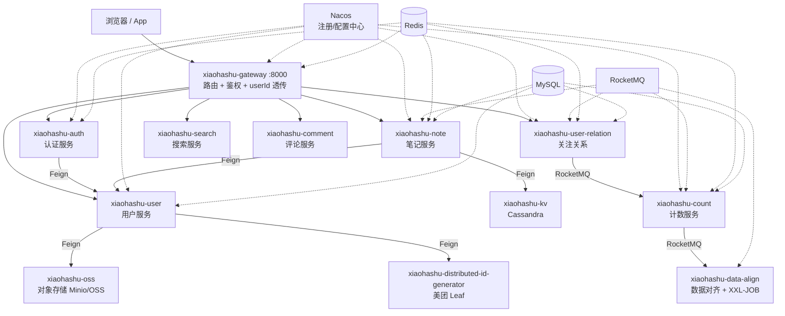

# 校园社区种草平台

[](https://www.oracle.com/java/)
[](https://spring.io/projects/spring-boot)
[](https://github.com/alibaba/spring-cloud-alibaba)
[](https://maven.apache.org/)

> 仿小红书（Xiaohongshu）社交平台，基于 **Spring Cloud Alibaba** 微服务架构实现的项目。

## 项目简介

校园社区种草平台是一个高并发场景驱动的微服务实战项目，实现了笔记发布、用户关注、计数统计等核心业务，重点实践了：

- **缓存一致性**：Caffeine → Redis → DB 三级缓存、延迟双删、MQ 广播删本地缓存
- **高并发写入**：RocketMQ 异步削峰 + Guava 令牌桶限流 + BufferTrigger 消息聚合
- **分布式 ID**：美团 Leaf 号段模式（双 Buffer）+ 雪花模式（ZooKeeper 分配 workerId）
- **数据最终一致**：分片临时表 + XXL-JOB 分片广播对齐 + 双 Bloom 去重

## 功能特性

- **网关服务**：统一入口、路由转发、Sa-Token 登录/权限校验、userId 全链路透传
- **认证服务**：验证码登录 / 密码登录、登出、修改密码、阿里云短信验证码（限流 + 告警策略）
- **用户服务**：注册（自动生成小哈书号）、资料管理、头像上传、RBAC 角色权限
- **笔记服务**：图文/视频笔记的发布、详情、更新、删除、置顶、仅自己可见
- **用户关系**：关注/取关（Redis ZSET + Lua 原子操作，MQ 异步落库）
- **计数服务**：粉丝数/关注数/笔记点赞收藏数统计（Redis Hash + 两级 MQ 落库）
- **数据对齐**：日增量落库 + 次日分片对齐，保证计数最终一致
- **搜索服务**：基于 Elasticsearch 的笔记搜索
- **评论服务**：笔记评论功能
- **对象存储**：Minio / 阿里云 OSS 策略模式动态切换，Nacos 配置热更新
- **分布式 ID**：号段模式 + 雪花模式双算法

## 技术栈

| 分类 | 技术 |
|------|------|
| 基础框架 | Java 17、Spring Boot 3.0.2、Spring Cloud 2022.0.0 |
| 微服务 | Spring Cloud Alibaba 2022.0.0.0、Nacos（注册 + 配置中心）、Spring Cloud Gateway、OpenFeign + LoadBalancer |
| 认证鉴权 | Sa-Token（集成 Redis 会话 + 网关 Reactor 过滤器） |
| 数据存储 | MySQL 8 + MyBatis + Druid、Redis、Cassandra（笔记正文 KV）、Elasticsearch 7.3 |
| 消息队列 | RocketMQ（普通 / 广播 / 延时消息） |
| 分布式 ID | 美团 Leaf（号段 + 雪花）、ZooKeeper |
| 定时任务 | XXL-JOB（分片广播） |
| 缓存 | Caffeine 本地缓存、Redis（ZSET / Hash / Lua / Bloom / Pipeline） |
| 对象存储 | Minio、阿里云 OSS |
| 工具库 | Lombok、MapStruct、Guava、Hutool、TransmittableThreadLocal |

## 系统架构



## 模块结构

```
xiaohashu (根聚合工程)
├── xiaoha-framework/                    # 平台基础设施层
│   ├── xiaoha-common/                   # 通用类库：常量、枚举、异常、统一响应、工具类
│   ├── xiaoha-spring-boot-starter-biz-operationlog/  # 操作日志 Starter（AOP）
│   ├── xiaoha-spring-boot-starter-biz-context/       # 登录用户上下文 Starter（TTL）
│   └── xiaoha-spring-boot-starter-jackson/           # 全局 Jackson 序列化 Starter
├── xiaohashu-gateway/                   # 网关服务（端口 8000）
├── xiaohashu-auth/                      # 认证服务（端口 8080）
├── xiaohashu-oss/                       # 对象存储服务（聚合）
│   ├── xiaohashu-oss-api/               #   RPC 接口层（Feign）
│   └── xiaohashu-oss-biz/               #   业务实现（端口 8081）
├── xiaohashu-user/                      # 用户服务（聚合）
│   ├── xiaohashu-user-api/              #   RPC 接口层
│   └── xiaohashu-user-biz/              #   业务实现（端口 8082）
├── xiaohashu-kv/                        # KV 存储服务（聚合，Cassandra）
│   ├── xiaohashu-kv-api/
│   └── xiaohashu-kv-biz/                #   业务实现（端口 8084）
├── xiaohashu-distributed-id-generator/  # 分布式 ID 服务（聚合，美团 Leaf）
│   ├── xiaohashu-distributed-id-generator-api/
│   └── xiaohashu-distributed-id-generator-biz/  # 业务实现（端口 8085）
├── xiaohashu-note/                      # 笔记服务（聚合）
│   ├── xiaohashu-note-api/
│   └── xiaohashu-note-biz/              #   业务实现（端口 8086）
├── xiaohashu-user-relation/             # 用户关系服务（聚合）
│   ├── xiaohashu-user-relation-api/
│   └── xiaohashu-user-relation-biz/     #   业务实现（端口 8089）
├── xiaohashu-count/                     # 计数服务（聚合）
│   ├── xiaohashu-count-api/
│   └── xiaohashu-count-biz/             #   业务实现（端口 8090）
├── xiaohashu-data-align/                # 数据对齐服务（端口 8091）
├── xiaohashu-search/                    # 搜索服务（聚合）
│   ├── xiaohashu-search-api/
│   └── xiaohashu-search-biz/            #   业务实现（端口 8092）
└── xiaohashu-comment/                   # 评论服务（聚合）
    ├── xiaohashu-comment-api/
    └── xiaohashu-comment-biz/           #   业务实现（端口 8093）
```

## 环境要求

| 组件 | 说明 |
|------|------|
| JDK | 17+ |
| Maven | 3.6+ |
| MySQL | 8.x |
| Redis | 6.x+ |
| Nacos | 2.x（注册中心 + 配置中心，需预先创建各服务配置） |
| RocketMQ | 4.x+ |
| ZooKeeper | 3.x（雪花模式 workerId 分配） |
| Cassandra | 3.x/4.x（keyspace `xiaohashu`） |
| XXL-JOB | 2.x/3.x（数据对齐分片任务） |
| Minio | 对象存储（或使用阿里云 OSS） |
| Elasticsearch | 7.3（搜索服务） |

## 快速开始

### 1. 克隆项目


### 2. 准备中间件

按「环境要求」启动 MySQL、Redis、Nacos、RocketMQ 等中间件，并初始化数据库表结构。

### 3. 导入 Nacos 配置

各服务通过 `bootstrap.yml` 从 Nacos 拉取配置，需在 Nacos 控制台按服务名创建对应配置（数据库连接、Redis 连接、RocketMQ 地址等），参考各服务 `src/main/resources/config/application-dev.yml` 中的配置项。

### 4. 构建打包

```bash
# 跳过测试打包（测试类依赖 Nacos/Redis 等中间件，本地未启动会构建失败）
mvn clean package -DskipTests=true
```

### 5. 配置敏感信息（环境变量）

仓库中不含任何真实密钥，阿里云 AK 通过环境变量注入（短信 / OSS 共用一对）：

| 环境变量 | 说明 |
|----------|------|
| `ALIYUN_ACCESS_KEY_ID` | 阿里云 AccessKey ID |
| `ALIYUN_ACCESS_KEY_SECRET` | 阿里云 AccessKey Secret |
| `REDIS_HOST` | Redis 地址（默认 `127.0.0.1`） |
| `REDIS_PASSWORD` | Redis 密码（默认为空） |

另外，分布式 ID 服务需要手动初始化本地配置：

```bash
# 复制模板并填入你自己的数据库密码（leaf.properties 已被 gitignore，不会提交）
cd xiaohashu-distributed-id-generator/xiaohashu-distributed-id-generator-biz/src/main/resources
cp leaf.properties.example leaf.properties
```

配置方式任选其一：

- **IDEA**：`Run/Debug Configurations` → 修改服务启动项 → `Environment variables` 中添加上述变量；
- **系统级**：Windows 在「系统环境变量」中添加后重启 IDEA。

### 6. 启动服务

按以下顺序启动各服务（IDEA 中运行各模块的 `*Application` 启动类）：

1. `XiaohashuGatewayApplication` — 网关（8000）
2. `XiaohashuDistributedIdGeneratorBizApplication` — 分布式 ID（8085）
3. `XiaohashuOssBizApplication` — 对象存储（8081）
4. `XiaohashuUserBizApplication` — 用户服务（8082）
5. `XiaohashuAuthApplication` — 认证服务（8080）
6. 其余业务服务按需启动


## 核心设计

| 主题 | 方案 |
|------|------|
| userId 透传 | 网关 Filter 写请求头 → 下游 Filter 解析入 ThreadLocal（TTL）→ Feign 拦截器继续透传 |
| 笔记详情多级缓存 | Caffeine（本地）→ Redis → MySQL，`CompletableFuture` 并行组装 |
| 缓存一致性 | 更新后延迟双删（延时 MQ）+ 广播消息删除各实例本地缓存 |
| 关注关系 | Redis ZSET 承载热点读，Lua 脚本保证「判重 + 上限 + 添加」原子性，MQ 异步落库 + 令牌桶削峰 |
| 计数 | Redis Hash 直更 + BufferTrigger 聚合高频消息 + 二级 MQ 令牌桶削峰落库 |
| 数据对齐 | 当天变更写「日期 + 分片」临时表（双 Bloom 幂等去重），次日 XXL-JOB 分片广播从源表重算回写 |
| 策略模式 | OSS 存储、告警方式均通过「接口 + 工厂 + Nacos 配置」动态切换（`@RefreshScope`） |

## 项目文档

更详细的架构设计与开发记录见 [docs](docs/) 目录：

- [01-项目架构](docs/01-项目架构/) — 项目结构梳理、架构选型与理由
- [02-开发指南](docs/02-开发指南/) — RocketMQ / XXL-JOB / Lua 脚本 / Starter 抽取等使用总结
- [03-业务流程](docs/03-业务流程/) — 核心业务链路详解
- [04-问题排查与记录](docs/04-问题排查与记录/) — 开发问题记录、排错手册
- [05-面试准备](docs/05-面试准备/) — 各服务面试题与场景设计题

## 声明

本项目仅供学习交流使用，不用于任何商业用途。界面与业务灵感来自小红书，相关商标归原作者所有。

## License

[MIT](LICENSE)
