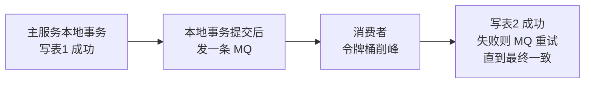

# 项目中常用注解总结 —— 零基础版

> 更新时间：2026-08-10
> 适用人群：**没接触过 Spring / 注解**的开发者。
>
> 整理项目里会遇到的各类注解：Controller 层、MyBatis、Spring 核心、Web 层、Lombok、Spring Boot 配置、事务与 AOP、参数校验、项目自定义注解等。
> 每个注解保留原有"**全限定名 / 作用 / 使用场景 / 注意 / 项目示例**"结构，并在开头补一句大白话；每个大类开头先讲"这是啥"。
> 建议第一次阅读先看"先读 3 分钟：什么是注解"，再按目录跳到想查的注解。

## 目录

- [先读 3 分钟：什么是注解、注解是怎么生效的](#intro)
- 一、[Controller 层](#ch1)：@RestController｜@RequestBody + @Validated
- 二、[Mybatis](#ch2)：@Param
- 三、[Spring 核心注解](#ch3)：@Service / @Component / @Repository / @Controller｜@Resource / @Autowired｜@Configuration / @Bean
- 四、[Web 层补充注解](#ch4)：@RequestMapping 及组合注解｜@PathVariable / @RequestParam｜@RequestPart
- 五、[Lombok 注解](#ch5)：@Data / @Builder / @AllArgsConstructor / @NoArgsConstructor｜@Slf4j / @SneakyThrows
- 六、[Spring Boot 配置类注解](#ch6)：@ConfigurationProperties｜@RefreshScope
- 七、[事务与 AOP 注解](#ch7)：@Transactional｜@Aspect / @Around / @Pointcut｜@EnableFeignClients / @MapperScan
- 八、[参数校验注解（JSR-303）](#ch8)：@NotNull / @NotBlank / @Size / @Email / @Pattern｜@PhoneNumber（项目自定义）｜@ApiOperationLog（项目自定义）
- 九、[Spring Boot 启动与自动装配](#ch9)：@SpringBootApplication｜@AutoConfiguration
- 十、[Feign 远程调用](#ch10)：@FeignClient
- 十一、[全局异常处理](#ch11)：@ControllerAdvice / @RestControllerAdvice + @ExceptionHandler
- 十二、[配置注入补充](#ch12)：@Value｜@Import
- 十三、[过滤器与执行顺序](#ch13)：@Order
- 十四、[Spring Data（Cassandra）注解](#ch14)：@Table / @PrimaryKey
- 十五、[RocketMQ 注解](#ch15)：@RocketMQMessageListener / @RocketMQListener

---

## 先读 3 分钟：什么是注解、注解是怎么生效的

### 3.1 什么是注解？—— 就是贴在代码上的"便利贴"

**一句话**：注解（Annotation）就是贴在 Java 代码上的**便利贴/标签**。便利贴本身不干活，但**读标签的人**（编译器、框架）看到它，就会自动帮你去干活。

**生活类比**：你把一张写着"微波炉加热 3 分钟"的便利贴贴在饭盒上，放进微波炉，微波炉（框架）看到标签就知道该怎么处理。便利贴自己没有加热能力，它只是"信息"，真正的动作由读取它的人执行。

```java
@RestController                       // ← 便利贴：告诉 Spring"这是接口控制器"
public class UserController { ... }
```

**常见误区澄清**：注解不是"给代码写的注释"（`//` 那种），它是**可以被程序读取的元数据**——Java 提供了专门的机制（反射等）来查看某个类/方法上贴了什么注解，框架正是靠这个机制"看到标签、执行动作"的。

### 3.2 注解是怎么生效的？—— 分两种时机

| 生效时机 | 谁在执行 | 典型代表 | 特点 |
|---------|---------|---------|------|
| **编译期** | 编译器插件（如 Lombok） | `@Data`、`@Slf4j`、`@Builder` | 写代码阶段就处理完，编译出来的 .class 里**已经带着生成好的代码**，所以写完代码立刻能用，不用等启动 |
| **运行时** | 框架（如 Spring、MyBatis、RocketMQ） | `@RestController`、`@Service`、`@Transactional` | 程序启动/运行期间，框架通过"扫描 + 反射"读标签再执行动作 |

### 3.3 运行时注解的"三步走"（以 Spring 为例）

Spring 启动时，对运行时注解做了三件事：

1. **扫描**：从启动类所在包开始，把包及子包下的所有类翻一遍，看谁身上贴了"注册类"的标签（如 `@Component` / `@Service` / `@RestController`）。
2. **创建 Bean 放进容器**：把贴了标签的类创建成对象（Bean），放进 Spring 的"大仓库"（IoC 容器）统一管理；别的类需要它时，通过 `@Autowired` / `@Resource` 自动注入，不用自己 `new`。
3. **代理增强**：对 `@Transactional`、`@Aspect` 这类"需要附加行为"的注解，Spring 会生成一个**代理对象**，在你真正干活的方法前后，帮你自动加事务、打日志。

**生活类比**：Spring 容器 = 餐厅；`@Service` 类 = 厨师（注册进后厨名单）；`@RestController` = 服务员（接待客人、只传菜不炒菜）；`@Transactional` = 餐厅的"这道菜有问题就免单退菜"规则（事务）。

### 3.4 两个最容易踩的坑（先记住，后面会反复出现）

1. **注解不扫描就不生效**：业务类必须放在**启动类所在包（或其子包）**下面，Spring 才扫得到；放在包外面，注解形同虚设。
2. **同类内部调用 `@Transactional` 不生效**：代理对象只对"从外部调进来"生效；同一个类里 `this.xxx()` 调自己的方法，绕过了代理，事务就没了（需要代理的原因见 3.3 第 3 步）。

> 另外提醒：项目里还有两个**自定义注解**（`@PhoneNumber`、`@ApiOperationLog`），它们就是本项目的同学自己写的"便利贴"，做法其实很简单（用 `@interface` 声明 + 写校验器/切面），详见第八章。

---

## 一、Controller 层

> **这是啥**：Controller 层是接口的"门面层"——前端（浏览器/App/小程序）的请求进来后第一个到的地方。这一层的注解决定三件事：**这个类是不是接口**（@RestController）、**请求体怎么变成 Java 对象**（@RequestBody）、**数据进门前要不要体检**（@Validated）。

## @RestController

**一句话大白话**：把类里的所有方法变成"只输出数据（JSON）、不返回页面"的接口，等价于 @Controller + @ResponseBody 一起用。

**@RestController** 是 @Controller 和 @ResponseBody 的组合体。

1. 核心作用
它的主要作用是：标记该类的所有方法返回的数据直接写入 HTTP 响应体中，而不是解析为视图页面。

传统 @Controller：通常用于返回视图（如 HTML 页面，JSP 等）。如果你想让某个方法返回 JSON 数据，你必须在那个方法上额外加 @ResponseBody。
@RestController：默认将所有方法的返回值视为 JSON/XML 数据（默认是 JSON），直接返回给前端（浏览器、App、小程序等）。

2. 源码解析
从源码可以很直观地看到它的定义：

```java
@Target(ElementType.TYPE)
@Retention(RetentionPolicy.RUNTIME)
@Documented
@Controller
@ResponseBody
public @interface RestController {
    // ...
}
```

它本质上就是同时加了 @Controller 和 @ResponseBody。

3. 什么时候用？
只要你是在开发 Web API 接口（后端提供给前端、移动端调用的接口），而不是开发 Web 页面（服务端渲染 HTML），就应该使用它。

适用场景（使用 @RestController）：
前后端分离项目：后端只负责提供数据接口（JSON），前端负责页面展示。
移动端 App 后端：为 iOS/Android 提供数据接口。
微服务架构：服务之间的调用通常也是通过 HTTP 传输 JSON 数据。
不适用场景（使用 @Controller）：
传统单体应用：使用 Thymeleaf、JSP、FreeMarker 等模板引擎，后端直接返回 HTML 页面给浏览器。
4. 代码对比
使用 @Controller (传统方式)
如果你想返回 JSON，必须手动加 @ResponseBody，否则 Spring 会去找对应的 HTML 页面。

```java
@Controller
public class UserController {
@RequestMapping("/user")
// 必须加这个注解，返回的才是 JSON，否则 Spring 会试图找 user.jsp 或 user.html
@ResponseBody 
public User getUser() {
    return new User("张三", 20);
}

}
```

使用 @RestController (现代方式)
省去了 @ResponseBody，代码更简洁。

```java
@RestController // 相当于 @Controller + @ResponseBody
public class UserController {

@RequestMapping("/user")
public User getUser() {
    // Spring MVC 会自动利用 Jackson 库将 User 对象转换为 JSON 字符串
    return new User("张三", 20);
}

}
```

前端收到的数据：

```json
{
    "name": "张三",
    "age": 20
}
```

总结
- 作用：简化注解，自动将返回对象转换为 JSON 格式写入 HTTP 响应体。
- 用法：在开发 RESTful API 或任何需要返回 JSON 数据的 Controller 类上使用。
- 原理：利用了 HTTP 消息转换器，通常是 MappingJackson2HttpMessageConverter，将 Java 对象序列化为 JSON。

## @RequestBody和@Validated

### @RequestBody

**一句话大白话**：把前端 POST 过来的 JSON 身体（Body）自动"翻译"成 Java 对象参数——你说"我要收一个 DTO"，它把请求体里的 JSON 填进去。

- **全限定名**：`org.springframework.web.bind.annotation.RequestBody`
- 作用
  - 用于将 HTTP 请求体中的内容（如 JSON 或 XML 数据）绑定到 Java 对象（即方法参数）上。
  - 它告诉 Spring："请把请求发过来的 Body 里的数据（通常是 JSON 字符串），解析并填充到这个参数对象里。"
- 使用场景
  - 前端发送 POST 请求，携带 JSON 数据。
  - 后端需要接收一个复杂的对象（DTO），而不是简单的单个参数。
- 注意
  - 一个方法只能有一个 `@RequestBody` 参数，因为请求体（Request Body）只有一份流，读取一次就没了。
  - 通常需要配合 `@PostMapping` 或 `@PutMapping` 使用。

### @Validated

**一句话大白话**：开启"参数体检"——按参数对象字段上贴的校验规则（@NotBlank、@Size 等），检查传进来的数据合不合格，不合格直接抛异常交给全局异常处理器。

- **全限定名**：`org.springframework.validation.annotation.Validated`
- 作用
  - 开启对参数的数据校验功能。
  - 它会根据参数对象（Java Bean）中定义的校验规则注解（如 `@NotNull`, `@NotBlank`, `@Email`, `@Min` 等）来验证传入的数据是否合法。
  - 如果数据不符合规则，Spring 会抛出异常（通常是 `MethodArgumentNotValidException`），开发者可以通过全局异常处理器来捕获并返回友好的错误信息给前端。
- **区别**：还有一个类似的注解叫 `@Valid`（属于 JSR-303/JSR-380 规范）。`@Validated` 是 Spring 提供的变体，它支持**分组校验**（Group Validation），功能比标准的 `@Valid` 更强大一些，但在简单场景下两者效果基本一致。

------

3. 组合使用示例

当这两个注解放在一起使用时，意味着：**"接收请求体的 JSON 数据，将其转换为 Java 对象，并且立即对该对象进行格式校验。"**

**代码示例：**

**(1) 定义一个 DTO (数据传输对象)，并加上校验注解：**

```java
import javax.validation.constraints.Email;
import javax.validation.constraints.NotBlank;
import javax.validation.constraints.Size;

public class UserLoginDTO {

    @NotBlank(message = "用户名不能为空")
    private String username;

    @NotBlank(message = "密码不能为空")
    @Size(min = 6, max = 20, message = "密码长度必须在6到20位之间")
    private String password;

    @Email(message = "邮箱格式不正确")
    private String email;

    // getter 和 setter 省略...
}
```

(2) 在 Controller 中使用 `@Validated` 和 `@RequestBody`：

```java
import org.springframework.validation.annotation.Validated;
import org.springframework.web.bind.annotation.PostMapping;
import org.springframework.web.bind.annotation.RequestBody;
import org.springframework.web.bind.annotation.RestController;

@RestController
public class LoginController {

    @PostMapping("/login")
    public String login(@Validated @RequestBody UserLoginDTO userDTO) {
        // 如果代码执行到这里，说明校验通过了，数据是合法的
        return "登录成功，用户：" + userDTO.getUsername();
    }
}
```

4. 执行流程解析

假设前端发送了一个 POST 请求：

```json
// 请求 URL: POST /login
// Body:
{
    "username": "",
    "password": "123",
    "email": "invalid-email"
}
```

1. **`@RequestBody`** 生效：Spring 尝试将 JSON 解析成 `UserLoginDTO` 对象。

2. **`@Validated` 生效**：Spring 检查对象字段：

   - `username` 是空字符串 -> 触发 `@NotBlank` -> **校验失败**。
   - `password` 长度小于 6 -> 触发 `@Size` -> **校验失败**。
   - `email` 格式不对 -> 触发 `@Email` -> **校验失败**。

3. **结果**：方法体内的代码 `return "登录成功..."` **不会执行**。Spring 会直接抛出异常，通常前端会收到类似 400 Bad Request 的响应，里面包含具体的错误信息（例如："用户名不能为空", "密码长度必须在6到20位之间"）。

总结

- **`@RequestBody`** 负责：**读数据**（把 JSON 变成 Java 对象）。
- **`@Validated`** 负责：**查数据**（检查这个 Java 对象的字段是否符合规则）。
- **组合使用**：实现了"接收并校验"的标准 Web 开发流程。

---

## 二、Mybatis

> **这是啥**：MyBatis 是"数据库翻译官"，把 Java 方法翻译成 SQL 去查库。Mapper 接口里定义方法，XML 里写 SQL。**@Param** 就是"翻译时给参数起个好认的名字"，让 SQL 能准确引用到参数。

## @Param

**一句话大白话**：给方法参数起一个"见名知意"的别名，好让 XML 里的 SQL 能准确引用它——不然只能用 arg0、list 这种看不懂的名字。

```java
import org.apache.ibatis.annotations.Param;
```

`@Param` 是 MyBatis（以及 MyBatis-Plus）中的一个注解，它的核心作用是：**给方法参数起一个别名，以便在 XML 映射文件或注解中通过这个别名引用该参数。**

1. 核心作用：命名参数

当你在 Mapper 接口中定义方法时，Java 编译器在编译成 `.class` 文件后，默认会丢失参数的具体名称（变成 `arg0`, `arg1`, `arg2` 等）。

如果不使用 `@Param`，你在 XML 文件中引用参数时会非常麻烦且不直观。使用了 `@Param("roleIds")` 后，MyBatis 就会知道这个参数的名字叫 `"roleIds"`。

2. 具体用法示例

场景一：在 XML 文件中使用（最常见）

集合类型参数时候，如果你不加 `@Param`，MyBatis 会给这个参数一个默认的名字。

- 对于 `List` 类型，默认名字叫 **`list`**。
- 对于 `Array` 类型，默认名字叫 **`array`**。

Mapper 接口：

```java
// 使用 @Param 给参数命名为 "roleIds"
List<RolePermissionDO> selectByRoleIds(@Param("roleIds") List<Long> roleIds);
```

**XML 映射文件：**

```xml
<select id="selectByRoleIds" resultType="com.example.RolePermissionDO">
    SELECT * FROM t_role_permission
    WHERE role_id IN
    <!-- 这里直接使用 @Param 定义的名字 "roleIds" -->
    <foreach collection="roleIds" item="roleId" open="(" separator="," close=")">
        #{roleId}
    </foreach>
</select>
```

*   **如果没有 `@Param`**：你在 XML 里可能需要写成 `collection="arg0"` 或者 `collection="list"`（如果是 List 类型默认叫 list），这使得代码可读性很差，且容易出错。

场景二：多参数传递（必须使用）

当方法有**多个参数**时，`@Param` 基本是必须的，用于区分不同的参数。

**Mapper 接口：**

```java
// 有两个参数：userId 和 status
UserDO selectUser(@Param("userId") Long id, @Param("status") Integer status);
```

**XML 映射文件：**
```xml
<select id="selectUser" resultType="com.example.UserDO">
    SELECT * FROM t_user 
    WHERE id = #{userId} AND status = #{status}
</select>
```

*   **如果没有 `@Param`**：MyBatis 不知道 `#{id}` 对应的是第一个参数还是第二个参数，会报错。

3. 总结

| 特性           | 不使用 @Param                                  | 使用 @Param                                  |
| :------------- | :--------------------------------------------- | :------------------------------------------- |
| **引用方式**   | 只能用 `param1`, `arg0` 或 `list` (集合默认名) | 可以用自定义的语义化名称，如 `roleIds`       |
| **可读性**     | 差，看不懂 `arg0` 代表什么                     | 好，见名知意                                 |
| **多参数支持** | 非常麻烦，容易混淆                             | 清晰明确，一一对应                           |
| **适用场景**   | 仅限单参数，且不在意 XML 可读性                | **推荐所有场景使用**，尤其是多参数或集合参数 |

---

## 三、Spring 核心注解

> **这是啥**：Spring 的"地基"三件套——**注册**（@Service/@Component 等：哪些类交给 Spring 管）、**注入**（@Resource/@Autowired：不用自己 new，Spring 把现成对象塞给你）、**配置**（@Configuration/@Bean：怎么造第三方对象放进容器）。

## @Service / @Component / @Repository / @Controller

**一句话大白话**：贴在类上告诉 Spring"这个类交给你管理"（注册成 Bean），启动时 Spring 自动创建好实例，别的类随时能注入使用。

- **全限定名**：`org.springframework.stereotype.Service`（其他同理）
- 作用
  - 四个注解都是**组件注册注解**，告诉 Spring"这个类要交给容器管理"（注册为 Bean），Spring 启动扫描后自动创建实例并管理其生命周期。
  - 分工约定：
    - `@Component`：通用组件（无明确分层时使用）
    - `@Service`：业务层（Service 实现类）
    - `@Repository`：数据访问层（DAO/Mapper）
    - `@Controller`：控制层
- 使用场景
  - 所有需要被 Spring 管理、并注入到其他地方使用的类。
- 注意
  - `@Service`/`@Repository` 本质上就是 `@Component` 的别名，功能相同，区分是为了语义清晰；
  - 需要配合组件扫描（启动类所在包及其子包）才会被注册。
- 本项目示例（[RelationServiceImpl](file:///d:/java/xiaohashu/xiaohashu/xiaohashu-user-relation/xiaohashu-user-relation-biz/src/main/java/com/quanxiaoha/xiaohashu/user/relation/biz/service/impl/RelationServiceImpl.java#L37-L39)）：

```java
@Service
@Slf4j
public class RelationServiceImpl implements RelationService { ... }
```

## @Resource / @Autowired

**一句话大白话**：不用自己 `new`，让 Spring 把容器里现成的对象（Bean）自动"塞"进这个字段或参数。

- **全限定名**：`jakarta.annotation.Resource`（`@Resource`）、`org.springframework.beans.factory.annotation.Autowired`（`@Autowired`）
- 作用
  - 都是**依赖注入**注解：把容器中的 Bean 自动注入到字段/方法参数中，免去手动 `new`。
- 区别
  - `@Autowired`：Spring 提供，默认**按类型**注入；同一类型有多个 Bean 时需要配合 `@Qualifier` 指定名字。
  - `@Resource`：JDK 提供（Jakarta），默认**按名称**（字段名/指定 name）注入，找不到再按类型。
- 使用场景
  - 注入 Service、Mapper、RedisTemplate、RocketMQTemplate 等所有 Bean。
- 注意
  - `@Resource` 是 `jakarta.annotation.Resource`（Java EE/Jakarta），别导错成旧 `javax` 包。
- 本项目示例（各 ServiceImpl 大量使用）：

```java
@Resource
private RedisTemplate<String, Object> redisTemplate;
@Resource
private UserRpcService userRpcService;
```

## @Configuration / @Bean

**一句话大白话**：写"配置类"用的——@Configuration 标记"这个类是配置类"，类里的 @Bean 方法把**返回值**注册成容器里的 Bean（常用于第三方对象，如 RedisTemplate、MinioClient）。

- **全限定名**：`org.springframework.context.annotation.Configuration`、`org.springframework.context.annotation.Bean`
- 作用
  - `@Configuration`：标记这是一个**配置类**，会被 Spring 扫描并处理类中 `@Bean` 方法；
  - `@Bean`：把方法的**返回值**注册为容器中的 Bean（用于装配第三方类，如 RedisTemplate、MinioClient）。
- 使用场景
  - 无法通过 `@Component` 直接注册的第三方对象（需要复杂构建逻辑的 Bean）。
- 本项目示例（[RedisTemplateConfig](file:///d:/java/xiaohashu/xiaohashu/xiaohashu-user/xiaohashu-user-biz/src/main/java/com/quanxiaoha/xiaohashu/user/biz/config/RedisTemplateConfig.java#L17-L35)）：

```java
@Configuration
public class RedisTemplateConfig {
    @Bean
    public RedisTemplate<String, Object> redisTemplate(RedisConnectionFactory connectionFactory) {
        RedisTemplate<String, Object> redisTemplate = new RedisTemplate<>();
        redisTemplate.setConnectionFactory(connectionFactory);
        // ... 设置序列化器
        redisTemplate.afterPropertiesSet();
        return redisTemplate;
    }
}
```

---

## <a id="ch4"></a>四、Web 层补充注解

> **这是啥**：继续讲接口细节——**URL 怎么映射到方法**（@RequestMapping 系列）、**参数从哪取**（路径里？@PathVariable；问号后面？@RequestParam；表单文件？@RequestPart）。

## @RequestMapping 及组合注解

**一句话大白话**：把"URL 地址"和"处理方法"对应起来——前端请求这个地址，就执行这个方法；@GetMapping 等组合注解额外限定了只能用哪种 HTTP 方法访问。

- **全限定名**：`org.springframework.web.bind.annotation.RequestMapping`，组合注解 `@GetMapping` / `@PostMapping` / `@PutMapping` / `@DeleteMapping`
- 作用
  - 建立 **URL 路径与处理方法**的映射关系：把请求路由到对应方法。
  - 组合注解 = `@RequestMapping(method = RequestMethod.XXX)` 的简写，同时限定 HTTP 方法。
- 使用场景
  - 类上写 `@RequestMapping("/user")` 定义统一前缀，方法上用组合注解细分接口。
- 注意
  - GET 用 `@GetMapping`，POST 用 `@PostMapping`，语义清晰且限定方法；`@RequestMapping` 不指定 method 时**所有方法都能访问**，不安全。
- 本项目示例（[UserController](file:///d:/java/xiaohashu/xiaohashu/xiaohashu-user/xiaohashu-user-biz/src/main/java/com/quanxiaoha/xiaohashu/user/biz/controller/UserController.java#L28-L49)）：

```java
@RestController
@RequestMapping("/user")
public class UserController {
    @PostMapping("/register")
    public Response<Long> register(@Validated @RequestBody RegisterUserReqDTO registerUserReqDTO) { ... }
}
```

## @PathVariable / @RequestParam

**一句话大白话**：从请求里取参数——@PathVariable 从 **URL 路径**里取（`/segment/get/abc` 里的 abc）；@RequestParam 从 **问号查询参数**里取（`/list?page=1` 里的 1）。

- **全限定名**：`org.springframework.web.bind.annotation.PathVariable`、`...RequestParam`
- 作用
  - `@PathVariable`：从 **URL 路径**中提取参数（RESTful 风格），如 `/id/segment/get/{key}`；
  - `@RequestParam`：从**查询参数**（query string）中取值，如 `/list?page=1`。
- 使用场景
  - RESTful 接口、分页查询等。
- 注意
  - `@PathVariable` 的路径占位符 `{key}` 与方法参数名必须一致（或显式写名字）。
- 本项目示例（[LeafController](file:///d:/java/xiaohashu/xiaohashu/xiaohashu-distributed-id-generator/xiaohashu-distributed-id-generator-biz/src/main/java/com/quanxiaoha/xiaohashu/distributed/id/generator/biz/controller/LeafController.java#L25-L31)）：

```java
@RequestMapping(value = "/segment/get/{key}")
public String getSegmentId(@PathVariable("key") String key) { ... }
```

## @RequestPart

**一句话大白话**：从 multipart 表单请求里取"文件/表单部分"——文件上传接口的 MultipartFile 参数就靠它接。

- **全限定名**：`org.springframework.web.bind.annotation.RequestPart`
- 作用
  - 从 `multipart/form-data` 请求中**绑定文件/表单部分**到参数（用于文件上传）。
- 使用场景
  - 接口接收 `MultipartFile` 文件。
- 注意
  - 前端必须用 `multipart/form-data` 提交，且字段名要与 `value` 一致（否则报 `Required part 'file' is not present`）。
- 本项目示例（[FileController.uploadFile](file:///d:/java/xiaohashu/xiaohashu/xiaohashu-oss/xiaohashu-oss-biz/src/main/java/com/quanxiaoha/xiaohashu/oss/biz/controller/FileController.java#L35-L36)）：

```java
@PostMapping(value = "/upload", consumes = MediaType.MULTIPART_FORM_DATA_VALUE)
public Response<?> uploadFile(@RequestPart(value = "file") MultipartFile file) { ... }
```

---

## 五、Lombok 注解

> **这是啥**：Lombok 是"编译期代写代码的机器人"——你在类上贴 `@Data`，编译时它就自动把 getter/setter/toString 等样板代码"补写"进产物，写代码时看不到、用的时候全都有。

## @Data / @Builder 

**一句话大白话**：一套"样板代码生成组合"——@Data 生成 getter/setter 等；@Builder 支持 `类名.builder().xxx().yyy().build()` 链式赋值（需全参构造）；@NoArgsConstructor 生成无参构造。DTO/DO/VO 类上最常见。

- **全限定名**：`lombok.Data` / `lombok.Builder` / `lombok.AllArgsConstructor` / `lombok.NoArgsConstructor`
- 作用
  - `@Data`：自动生成 getter / setter / toString / equals / hashCode；
  - `@Builder`：生成**建造者模式**，支持链式赋值（必须配合全参构造，因此常加 `@AllArgsConstructor`）；
  - `@NoArgsConstructor`：生成无参构造。
- 使用场景
  - DTO / DO / VO 实体类。
- 本项目示例（[NoteDO 构建](file:///d:/java/xiaohashu/xiaohashu/xiaohashu-note/xiaohashu-note-biz/src/main/java/com/quanxiaoha/xiaohashu/note/biz/service/impl/NoteServiceImpl.java#L172-L188)）：

```java
NoteDO noteDO = NoteDO.builder()
        .id(Long.valueOf(snowflakeIdId))
        .creatorId(creatorId)
        .title(publishNoteReqVO.getTitle())
        .type(type)
        .contentUuid(contentUuid)
        .build();
```

## @Slf4j / @SneakyThrows

**一句话大白话**：@Slf4j 自动生成 `log` 日志对象（直接 `log.info()` 就能打日志）；@SneakyThrows 免写 try-catch/throws，把受检异常直接"偷偷"抛出去（比如简化 `CompletableFuture.get()`）。

- **全限定名**：`lombok.extern.slf4j.Slf4j`、`lombok.SneakyThrows`
- 作用
  - `@Slf4j`：自动生成 `log` 日志对象（`private static final Logger log = LoggerFactory.getLogger(...)`），直接 `log.info()` 即可；
  - `@SneakyThrows`：方法内**免写 try-catch/throws**，把受检异常直接抛出（编译期"欺骗"，运行时正常抛出）。
- 使用场景
  - 所有需要打日志的类；需要抛受检异常又不想写 throws 的方法。
- 注意
  - `@SneakyThrows` 会掩盖异常声明，生产代码慎用，适合简化非关键路径（如 `CompletableFuture.get()`）。
- 本项目示例（[NoteServiceImpl.findNoteDetail](file:///d:/java/xiaohashu/xiaohashu/xiaohashu-note/xiaohashu-note-biz/src/main/java/com/quanxiaoha/xiaohashu/note/biz/service/impl/NoteServiceImpl.java#L211-L212)）：

```java
@Override
@SneakyThrows
public Response<FindNoteDetailRspVO> findNoteDetail(FindNoteDetailReqVO findNoteDetailReqVO) {
    // 内部直接调用 resultFuture.get() 而不写 throws
}
```

---

## 六、Spring Boot 配置类注解

> **这是啥**：把 `application.yml` 里的配置变成 Java 可读的东西——**@ConfigurationProperties** 批量绑定一堆配置到类的字段；**@RefreshScope** 让 Bean 支持"改配置不重启"。

## @ConfigurationProperties

**一句话大白话**：把配置文件里同一前缀（如 `storage.minio.*`）的一堆配置项，一次性批量绑定到类的字段上，字段名和配置项自动对应。

- **全限定名**：`org.springframework.boot.context.properties.ConfigurationProperties`
- 作用
  - 将 **配置文件（application.yml）中指定前缀的配置项**批量绑定到类的字段上（自动映射）。
- 使用场景
  - 读取自定义配置（如 OSS/Minio 的 accessKey、endpoint 等）。
- 注意
  - 需要配合 `@Configuration` / `@Component` 或启动类 `@EnableConfigurationProperties` 注册为 Bean。
- 本项目示例（`MinioProperties`）：

```java
@ConfigurationProperties(prefix = "storage.minio")
public class MinioProperties {
    private String endpoint;
    private String accessKey;
    private String secretKey;
    private String bucket;
}
```

## @RefreshScope

**一句话大白话**：让这个 Bean 能"热更新"——Nacos 配置中心里改了配置，这个 Bean 会自动重建、加载新值，不用重启应用。

- **全限定名**：`org.springframework.cloud.context.config.annotation.RefreshScope`
- 作用
  - 使 Bean 支持**配置动态刷新**：配置中心（Nacos Config）变更后，该 Bean 会重建并加载新配置，无需重启应用。
- 使用场景
  - 需要热更新的配置类（如存储策略开关、告警开关）。
- 注意
  - 必须配合 Nacos Config（`nacos.config`）才会触发 `RefreshEvent`，只有注解没有配置中心不生效（详见《项目排错手册》第 13 条）。
- 本项目示例（[FileStrategyFactory](file:///d:/java/xiaohashu/xiaohashu/xiaohashu-oss/xiaohashu-oss-biz/src/main/java/com/quanxiaoha/xiaohashu/oss/biz/factory/FileStrategyFactory.java#L19-L26)）：

```java
@RefreshScope
public class FileStrategyFactory { ... }
```

---

## 七、事务与 AOP 注解

> **这是啥**：给方法"打包保险"和"统一增强"——**@Transactional** 是事务保险（要么全成功要么全回滚）；**@Aspect/@Around/@Pointcut** 是 AOP 切面（不改原方法，在方法前后统一加逻辑）；**@EnableFeignClients/@MapperScan** 是启动类上的两个"扫描开关"。

## @Transactional

**一句话大白话**：给方法加"事务保险"——方法里所有数据库操作要么全部成功提交，要么全部回滚，不会出现"写了一半"的脏数据。

- **全限定名**：`org.springframework.transaction.annotation.Transactional`
- 作用
  - 声明**事务边界**：方法内所有 DB 操作要么全部成功提交，要么全部回滚。
- 使用场景
  - 多表更新、写操作组合的业务方法。
- 注意
  - 只对**本地 DB 事务**生效，RPC（Feign 调用）不在事务内；
  - `rollbackFor = Exception.class` 表示所有异常都回滚（默认只回滚 RuntimeException）；
  - 同类内部调用不生效（需要代理）。
- 本项目示例（[NoteServiceImpl.updateNote](file:///d:/java/xiaohashu/xiaohashu/xiaohashu-note/xiaohashu-note-biz/src/main/java/com/quanxiaoha/xiaohashu/note/biz/service/impl/NoteServiceImpl.java#L351-L353)）：

```java
@Transactional(rollbackFor = Exception.class)
public Response<?> updateNote(UpdateNoteReqVO updateNoteReqVO) { ... }
```

### @Transactional 与分布式编程（微服务场景）

> 划重点：**@Transactional 只管"一个服务、一个数据库"的本地事务**。微服务把系统拆成多个服务、各连各的库，跨服务的操作用 @Transactional 是管不了的——它不知道另一个服务的库改了没有。

**为什么管不了（举例）**：关注用户时，要同时改"关注表 + 粉丝表"。如果两个表在**同一个服务、同一个库**里，@Transactional 能保证"要么都写、要么都回滚"。但如果"关注表"在 A 服务、"粉丝表"在 B 服务，A 服务的事务提交后，B 服务写失败——A 已经回滚不了了，两边数据就对不上了（这叫**分布式事务**问题）。

**本项目怎么解决（最终一致性）**：不用分布式事务框架（Seata 等），而是**"本地事务 + MQ 最终一致"**：



对应代码：关注时 [FollowUnfollowConsumer](file:///d:/java/xiaohashu/xiaohashu/xiaohashu-user-relation/xiaohashu-user-relation-biz/src/main/java/com/quanxiaoha/xiaohashu/user/relation/biz/consumer/FollowUnfollowConsumer.java#L103-L128) 用**编程式事务**（`TransactionTemplate`）保证"关注表 + 粉丝表"两条记录同时成功或回滚——这是**同一个库**里的事务；而"通知 count 服务计数"这种**跨服务**的操作，事务提交成功后才发 MQ，交给 MQ 的可靠投递 + 消费端重试保证最终一致。

**速查表**：

| 场景 | 用 @Transactional 吗 | 替代方案 |
|------|--------------------|---------|
| 同一个服务、同一个库，改多张表 | ✅ 用（`rollbackFor = Exception.class`） | —— |
| 同一个服务，但先写库再通知别的服务 | ⚠️ 只用它管本地那几步 | 事务提交后**再发 MQ**（不能把发 MQ 放进事务里） |
| 跨服务（改 A 服务库 + B 服务库） | ❌ 管不了 | **MQ 最终一致**：本地事务成功 → 发 MQ → 消费端落库重试 |
| 只读操作 / 单条 SQL | ❌ 不需要 | —— |

**3 个必须记住的坑**：
1. **发 MQ 别放事务里**：如果事务里发 MQ 然后事务回滚，MQ 已经发出去了，对方收到一条"不该发生"的消息 → 先提交事务，再发 MQ；
2. **同类内部调用不生效**：`this` 调用自己类的另一个 @Transactional 方法，事务不生效（需要 Spring 代理，跨 Bean 调用才行）；
3. **默认只回滚 RuntimeException**：想所有异常都回滚，必须写 `rollbackFor = Exception.class`（项目统一这么写）。

## @Aspect / @Around / @Pointcut

**一句话大白话**：AOP 切面三兄弟——@Pointcut 定义"管哪些方法"（切点），@Around 定义"方法执行前后都要干的事"（环绕通知），@Aspect 标记整个类是一个切面。不改原方法，就能统一打日志、统计耗时。

- **全限定名**：`org.aspectj.lang.annotation.Aspect`、`...Around`、`...Pointcut`
- 作用
  - AOP 切面编程：在不改原方法的前提下，统一增强（打印日志、权限校验、耗时统计等）。
  - `@Pointcut` 定义切点（匹配哪些方法）；`@Around` 定义环绕通知（方法前后都执行）。
- 使用场景
  - 接口操作日志、全局异常处理、事务等横切逻辑。
- 本项目示例（操作日志 Starter 的 [ApiOperationLogAspect](file:///d:/java/xiaohashu/xiaohashu/xiaoha-framework/xiaoha-spring-boot-starter-biz-operationlog/src/main/java/com/quanxiaoha/framework/biz/operationlog/aspect/ApiOperationLogAspect.java#L55)）：用 `@Aspect` + `@Around` 拦截标了 `@ApiOperationLog` 的接口，打印入参/出参/耗时。

## @EnableFeignClients / @MapperScan

**一句话大白话**：启动类上的两个"开启开关"——@EnableFeignClients 开启 Feign 客户端扫描（让 @FeignClient 接口自动生成远程调用代理）；@MapperScan 指定 MyBatis Mapper 接口的扫描路径（免去每个 Mapper 单独加 @Mapper）。

- **全限定名**：`org.springframework.cloud.openfeign.EnableFeignClients`、`org.mybatis.spring.annotation.MapperScan`
- 作用
  - `@EnableFeignClients`：开启 Feign 客户端扫描，让 `@FeignClient` 接口自动生成代理 Bean，实现服务间 RPC；
  - `@MapperScan`：指定 MyBatis **Mapper 接口扫描路径**，自动注册（替代每个 Mapper 单独加 `@Mapper`）。
- 使用场景
  - 微服务启动类（两者都写在启动类上）。
- 本项目示例（[XiaohashuNoteBizApplication](file:///d:/java/xiaohashu/xiaohashu/xiaohashu-note/xiaohashu-note-biz/src/main/java/com/quanxiaoha/xiaohashu/note/biz/XiaohashuNoteBizApplication.java#L9-L10)）：

```java
@MapperScan("com.quanxiaoha.xiaohashu.note.biz.domain.mapper")
@EnableFeignClients(basePackages = "com.quanxiaoha.xiaohashu")
@SpringBootApplication
public class XiaohashuNoteBizApplication { ... }
```

---

## <a id="ch8"></a>八、参数校验注解（JSR-303）

> **这是啥**：给 DTO/VO 的字段贴"体检规则"（@NotNull 不能空、@Email 要是邮箱格式……），配合 @Validated 自动检查，不合格就抛异常统一返回友好提示。这章还包括两个**项目自定义注解**（@PhoneNumber、@ApiOperationLog）——自己写的"便利贴"。

## @NotNull / @NotBlank / @Size / @Email / @Pattern

**一句话大白话**：字段上的"体检规则"——@NotNull 不能为 null、@NotBlank 不能是空白（字符串专用）、@Size 限制长度范围、@Email 检查邮箱格式、@Pattern 按正则匹配；配合 @Validated 在接口入口自动体检。

- **全限定名**：`jakarta.validation.constraints.*`
- 作用
  - 声明字段的校验规则，配合 `@Validated` 自动校验：
    - `@NotNull`：不能为 null（可空字符串）
    - `@NotBlank`：不能为 null，且去除空格后不能为空（字符串专用）
    - `@Size(min, max)`：长度/大小范围
    - `@Email`：邮箱格式
    - `@Pattern(regexp)`：正则匹配
- 使用场景
  - DTO/VO 字段，配合 Controller 参数 `@Validated` 生效。
- 注意
  - 校验失败抛 `MethodArgumentNotValidException`，由全局异常处理器统一返回。

## @PhoneNumber（项目自定义）

**一句话大白话**：项目自制的手机号校验注解——效果和标准校验注解一样，但业务语义更明确（看到 @PhoneNumber 就知道是查手机号格式）。做法：用 `@interface` 声明 + `validatedBy` 指定校验器实现。

- **全限定名**：`com.quanxiaoha.framework.common.validator.PhoneNumber`
- 作用
  - 项目在 xiaoha-common 中**自定义的手机号校验注解**，通过 `@interface` 声明 + `validatedBy` 指定校验器（`PhoneNumberValidator`）实现，规则与 JSR-303 注解一致，只是业务语义更明确。
- 使用场景
  - 登录、注册、发送验证码等接口的手机号参数。
- 本项目示例（[SendVerificationCodeReqVO](file:///d:/java/xiaohashu/xiaohashu/xiaohashu-auth/src/main/java/com/quanxiaoha/xiaohashu/auth/model/vo/verificationcode/SendVerificationCodeReqVO.java#L17)）：

```java
@Data
public class SendVerificationCodeReqVO {
    @PhoneNumber
    private String phone;
}
```

## @ApiOperationLog（项目自定义）

**一句话大白话**：项目自制注解——标在接口方法上，自动打印这个接口的入参、出参、耗时日志（联调排错神器）。靠的是配套的 AOP 切面（@Aspect + @Around）拦截。

- **全限定名**：`com.quanxiaoha.framework.biz.operationlog.aspect.ApiOperationLog`
- 作用
  - 项目在 operationlog Starter 中定义的**接口操作日志注解**，配合 `ApiOperationLogAspect` 自动打印接口入参、出参、耗时。
- 使用场景
  - Controller 接口方法，联调排错时非常好用。
- 本项目示例（[RelationController.follow](file:///d:/java/xiaohashu/xiaohashu/xiaohashu-user-relation/xiaohashu-user-relation-biz/src/main/java/com/quanxiaoha/xiaohashu/user/relation/biz/controller/RelationController.java#L30-L34)）：

```java
@PostMapping("/follow")
@ApiOperationLog(description = "关注用户")
public Response<?> follow(@Validated @RequestBody FollowUserReqVO followUserReqVO) { ... }
```

---

## <a id="ch9"></a>九、Spring Boot 启动与自动装配

> **这是啥**：启动类为什么是"总开关"（@SpringBootApplication）？自己写的 starter 怎么做到"引入依赖就自动生效"（@AutoConfiguration）？这一章讲清楚。

## @SpringBootApplication

**一句话大白话**：启动类的"总开关"，一个注解顶三个——标记这是配置类 + 开启自动配置 + 扫描启动类所在包及子包的所有组件。

- **全限定名**：`org.springframework.boot.autoconfigure.SpringBootApplication`
- 作用
  - **启动类注解**，组合了三个注解：
    - `@SpringBootConfiguration`：标记为配置类
    - `@EnableAutoConfiguration`：开启自动配置
    - `@ComponentScan`：扫描启动类所在包及其子包的组件
- 使用场景
  - 每个 Spring Boot 服务的入口类（main 方法所在类）。
- 注意
  - 业务代码必须放在启动类**所在包或其子包**下，否则扫描不到。
- 本项目示例（[XiaohashuNoteBizApplication](file:///d:/java/xiaohashu/xiaohashu/xiaohashu-note/xiaohashu-note-biz/src/main/java/com/quanxiaoha/xiaohashu/note/biz/XiaohashuNoteBizApplication.java#L8-L11)）：

```java
@SpringBootApplication
public class XiaohashuNoteBizApplication {
    public static void main(String[] args) {
        SpringApplication.run(XiaohashuNoteBizApplication.class, args);
    }
}
```

## @AutoConfiguration

**一句话大白话**：标记"这是自动配置类"——配合 `AutoConfiguration.imports` 文件登记，实现"别人引入你的 starter 依赖，配置就自动生效"，不用人家手动去 Import。

- **全限定名**：`org.springframework.boot.autoconfigure.AutoConfiguration`
- 作用
  - 标记**自动配置类**（Spring Boot 2.7+ 替代 `@Configuration` + 条件注解的老写法），配合 `META-INF/spring/org.springframework.boot.autoconfigure.AutoConfiguration.imports` 文件注册，实现"**引入依赖即自动生效**"。
- 使用场景
  - 自定义 Starter（本项目 xiaoha-spring-boot-starter-* 系列）。
- 注意
  - 仅靠 `@AutoConfiguration` 不会自动加载，必须在 `AutoConfiguration.imports` 文件中登记类名（详见《Starter组件抽取指南》）。
- 本项目示例（[JacksonAutoConfiguration](file:///d:/java/xiaohashu/xiaoha-framework/xiaoha-spring-boot-starter-jackson/src/main/java/com/quanxiaoha/framework/jackson/config/JacksonAutoConfiguration.java#L44)）：

```java
@AutoConfiguration
public class JacksonAutoConfiguration {
    @Bean
    public ObjectMapper objectMapper() { ... }
}
```

---

## <a id="ch10"></a>十、Feign 远程调用

> **这是啥**：服务之间互相调用的"对讲机"——@FeignClient 把接口声明成远程客户端，方法上写 @GetMapping/@PostMapping，就能像调本地方法一样调别的服务的 HTTP 接口。

## @FeignClient

**一句话大白话**：贴在接口上声明"这是一个远程调用客户端"——接口里的每个方法都会被子类实现成真实的 HTTP 请求，调它就像打本地电话，实际请求的是另一个服务。

- **全限定名**：`org.springframework.cloud.openfeign.FeignClient`
- 作用
  - 标记接口为 **Feign 客户端**：声明式调用远程服务，接口方法上写 `@GetMapping/@PostMapping` 等即可像调本地方法一样调远程 HTTP 接口。
- 使用场景
  - 服务间 RPC 调用（api 模块中定义，biz 服务实现）。
- 注意
  - `name` 必须是目标服务在 Nacos 注册的服务名；接口方法的路径与目标 Controller 的路径必须一致；
  - 需要启动类 `@EnableFeignClients(basePackages = ...)` 开启扫描。
- 本项目示例（[FileFeignApi](file:///d:/java/xiaohashu/xiaohashu/xiaohashu-oss/xiaohashu-oss-api/src/main/java/com/quanxiaoha/xiaohashu/oss/api/FileFeignApi.java#L32-L33)）：

```java
@FeignClient(name = ApiConstants.SERVICE_NAME, configuration = FeignFormConfig.class)
public interface FileFeignApi {
    @PostMapping(value = "/file/upload", consumes = MediaType.MULTIPART_FORM_DATA_VALUE)
    Response<?> uploadFile(@RequestPart(value = "file") MultipartFile file);
}
```

---

## <a id="ch11"></a>十一、全局异常处理

> **这是啥**：所有异常的"收容站"——@RestControllerAdvice 标记全局异常处理类，@ExceptionHandler 指定"哪种异常由哪个方法处理"，统一转成友好的错误响应，业务代码里就不用到处 try-catch 了。

## @ControllerAdvice / @RestControllerAdvice + @ExceptionHandler

**一句话大白话**：全局异常处理器——@RestControllerAdvice 贴在类上"我是全项目的异常处理中心"，类里的 @ExceptionHandler 方法按异常类型"接单"，统一返回友好错误信息。

- **全限定名**：`org.springframework.web.bind.annotation.ControllerAdvice`、`...RestControllerAdvice`、`...ExceptionHandler`
- 作用
  - `@RestControllerAdvice`（= `@ControllerAdvice` + `@ResponseBody`）：标记**全局异常处理类**，可对全局 Controller 统一生效；
  - `@ExceptionHandler(异常类型.class)`：指定该方法处理哪种异常，统一返回友好错误信息。
- 使用场景
  - 每个 biz 服务的全局异常处理（捕获 `BizException`、`MethodArgumentNotValidException`、`IllegalArgumentException`、兜底 `Exception`）。
- 注意
  - 多个 `@ExceptionHandler` 按异常类型精确匹配，兜底用 `Exception.class` 放在最后；
  - 校验失败（`@Validated`）抛的 `MethodArgumentNotValidException` 也在这里统一处理。
- 本项目示例（[GlobalExceptionHandler](file:///d:/java/xiaohashu/xiaohashu/xiaohashu-user/xiaohashu-user-biz/src/main/java/com/quanxiaoha/xiaohashu/user/biz/exception/GlobalExceptionHandler.java#L21-L24)）：

```java
@ControllerAdvice
public class GlobalExceptionHandler {
    @ExceptionHandler({ BizException.class })
    public Response<?> handleException(BizException e) { ... }
}
```

---

## <a id="ch12"></a>十二、配置注入补充

> **这是啥**：两个"补丁"注解——**@Value** 读配置文件里的单个配置项；**@Import** 手动把不在扫描路径下的类注册成 Bean。

## @Value

**一句话大白话**：从配置文件里读**单个**配置项塞进字段（`@Value("${key}")`）；和 @ConfigurationProperties（批量绑定）互补，只读一两个配置时用它更简洁。

- **全限定名**：`org.springframework.beans.factory.annotation.Value`
- 作用
  - 把**配置文件中的单个配置项**注入到字段/参数上（`@Value("${key}")`），与 `@ConfigurationProperties`（批量绑定）互补。
- 使用场景
  - 只读取一两个配置项时更简洁。
- 注意
  - 找不到 key 时启动报错，可用默认值 `@Value("${storage.type:minio}")`。
- 本项目示例（[FileStrategyFactory](file:///d:/java/xiaohashu/xiaohashu/xiaohashu-oss/xiaohashu-oss-biz/src/main/java/com/quanxiaoha/xiaohashu/oss/biz/factory/FileStrategyFactory.java#L19-L26)、[CassandraConfig](file:///d:/java/xiaohashu/xiaohashu/xiaohashu-kv/xiaohashu-kv-biz/src/main/java/com/quanxiaoha/xiaohashu/kv/biz/config/CassandraConfig.java)）：

```java
@Value("${storage.type}")
private String storageType;
```

## @Import

**一句话大白话**：手动"点名"把某个配置类/普通类注册成 Bean——用于引入不在 Spring 扫描路径下的类（比如第三方的自动配置类）。

- **全限定名**：`org.springframework.context.annotation.Import`
- 作用
  - 手动把指定的**配置类/普通类注册为 Bean**（用于引入不在扫描路径下的类）。
- 使用场景
  - 引入第三方自动配置类。
- 本项目示例（[RocketMQConfig](file:///d:/java/xiaohashu/xiaohashu/xiaohashu-note/xiaohashu-note-biz/src/main/java/com/quanxiaoha/xiaohashu/note/biz/config/RocketMQConfig.java#L14-L15)）：

```java
@Configuration
@Import(RocketMQAutoConfiguration.class)
public class RocketMQConfig { }
```

---

## <a id="ch13"></a>十三、过滤器与执行顺序

> **这是啥**：请求经过网关时会穿过一串"关卡"（过滤器），**@Order** 就是给这些关卡排先后顺序的——数字越小越先执行。

## @Order

**一句话大白话**：给同类型的多个 Bean（过滤器/拦截器）排执行顺序——数字越小，优先级越高、越先执行（负数值表示抢在所有默认值前面跑）。

- **全限定名**：`org.springframework.core.annotation.Order`
- 作用
  - 控制**多个相同类型 Bean（过滤器/拦截器）的执行顺序**，数值越小优先级越高。
- 使用场景
  - 网关过滤器链（如 userId 透传过滤器）。
- 本项目示例（[AddUserId2HeaderFilter](file:///d:/java/xiaohashu/xiaohashu/xiaohashu-gateway/src/main/java/com/quanxiaoha/xiaohashu/gateway/filter/AddUserId2HeaderFilter.java#L22)）：

```java
@Component
@Order(-90) // 负数，保证在 Sa-Token 鉴权过滤器之后、业务转发之前执行
public class AddUserId2HeaderFilter implements GlobalFilter { ... }
```

---

## <a id="ch14"></a>十四、Spring Data（Cassandra）注解

> **这是啥**：KV 服务（笔记正文存储）用的是 Cassandra 数据库，这一章是它的实体映射注解——@Table 指定表名、@PrimaryKey 标记主键，跟 JPA 的 @Entity/@Id 类似但属于 Cassandra 体系。

## @Table / @PrimaryKey

**一句话大白话**：Cassandra 版的"表和主键"注解——@Table("表名") 把实体类和表对应起来，@PrimaryKey 标记哪个字段是主键。

- **全限定名**：`org.springframework.data.cassandra.core.mapping.Table`、`...PrimaryKey`
- 作用
  - `@Table("表名")`：实体类映射到 **Cassandra 表**；
  - `@PrimaryKey`：标记**主键**（partition key）。
- 使用场景
  - Cassandra（kv 服务）的实体类。
- 注意
  - 与 JPA 的 `@Entity/@Id` 类似，但属于 Spring Data Cassandra 体系。
- 本项目示例（[NoteContentDO](file:///d:/java/xiaohashu/xiaohashu/xiaohashu-kv/xiaohashu-kv-biz/src/main/java/com/quanxiaoha/xiaohashu/kv/biz/domain/dataobject/NoteContentDO.java#L25)）：

```java
@Table("note_content")
public class NoteContentDO {
    @PrimaryKey("id")
    private UUID id;
    private String content;
}
```

---

## <a id="ch15"></a>十五、RocketMQ 注解

> **这是啥**：消息队列消费端的注解——@RocketMQMessageListener 贴在类上声明"我是消费者、消费哪个 Topic"，实现 @RocketMQListener 接口的 onMessage 方法处理消息。

## @RocketMQMessageListener / @RocketMQListener

**一句话大白话**：写 MQ 消费者的三件套——类上贴 @RocketMQMessageListener（告诉 RocketMQ"我要消费哪个 Topic、属于哪个消费组、什么模式"），实现 RocketMQListener 接口（框架要求你实现 onMessage 处理消息）。

- **全限定名**：`org.apache.rocketmq.spring.annotation.RocketMQMessageListener`、`org.apache.rocketmq.spring.core.RocketMQListener`
- 作用
  - `@RocketMQMessageListener`：声明一个 **MQ 消费者**，指定消费组（`consumerGroup`）、Topic、消费模式（`messageModel`，默认 CLUSTERING，广播用 `BROADCASTING`）；
  - `RocketMQListener<T>`：消费者接口，实现 `onMessage(T msg)` 处理消息。
- 使用场景
  - 所有 MQ 消息消费者（删本地缓存广播、延时双删）。
- 注意
  - 广播模式下同消费组的**每个实例都会消费**；延时消息靠发送端 `delayLevel` 控制。
- 本项目示例（[DeleteNoteLocalCacheConsumer](file:///d:/java/xiaohashu/xiaohashu/xiaohashu-note/xiaohashu-note-biz/src/main/java/com/quanxiaoha/xiaohashu/note/biz/consumer/DeleteNoteLocalCacheConsumer.java#L20-L30)）：

```java
@RocketMQMessageListener(consumerGroup = "xiaohashu_group",
        topic = MQConstants.TOPIC_DELETE_NOTE_LOCAL_CACHE,
        messageModel = MessageModel.BROADCASTING) // 广播模式
public class DeleteNoteLocalCacheConsumer implements RocketMQListener<String> {
    @Override
    public void onMessage(String body) {
        // 删除本地缓存
    }
}
```

