# 业务流程

> 记录项目核心业务代码的调用流程图：请求入口 → 业务处理 → 外部依赖（RPC / Redis / MQ / DB）→ 返回。
> 更新时间：2026-08-21

## 目录

1. [登录 / 注册](#1-登录--注册auth)
2. [退出登录](#2-退出登录auth)
3. [修改密码](#3-修改密码auth)
4. [用户信息查询](#4-用户信息查询user)
5. [角色权限数据同步](#5-角色权限数据同步user)
6. [发布笔记](#6-发布笔记note)
7. [查询笔记详情](#7-查询笔记详情note)
8. [更新笔记（延迟双删）](#8-更新笔记延迟双删note)
9. [网关统一鉴权](#9-网关统一鉴权gateway)
10. [更新用户信息](#10-更新用户信息user)
11. [删除笔记](#11-删除笔记note)
12. [仅自己可见](#12-仅自己可见note)
13. [置顶 / 取消置顶](#13-置顶--取消置顶note)
14. [关注用户](#14-关注用户user-relation新模块)
15. [查询关注列表](#15-查询关注列表user-relation)
16. [取关用户](#16-取关用户user-relation)
17. [查询粉丝列表](#17-查询粉丝列表user-relation)
18. [粉丝数 / 关注数计数（count）](#18-粉丝数--关注数计数count)
19. [数据对齐（日增量落库 + XXL-JOB 分片对齐，data-align）](#19-数据对齐日增量落库--xxl-job-分片对齐data-align)

---

## 1. 登录 / 注册（auth）

**代码**：[AuthServiceImpl.loginAndRegister](file:///d:/java/xiaohashu/xiaohashu/xiaohashu-auth/src/main/java/com/quanxiaoha/xiaohashu/auth/service/impl/AuthServiceImpl.java#L54-L129)

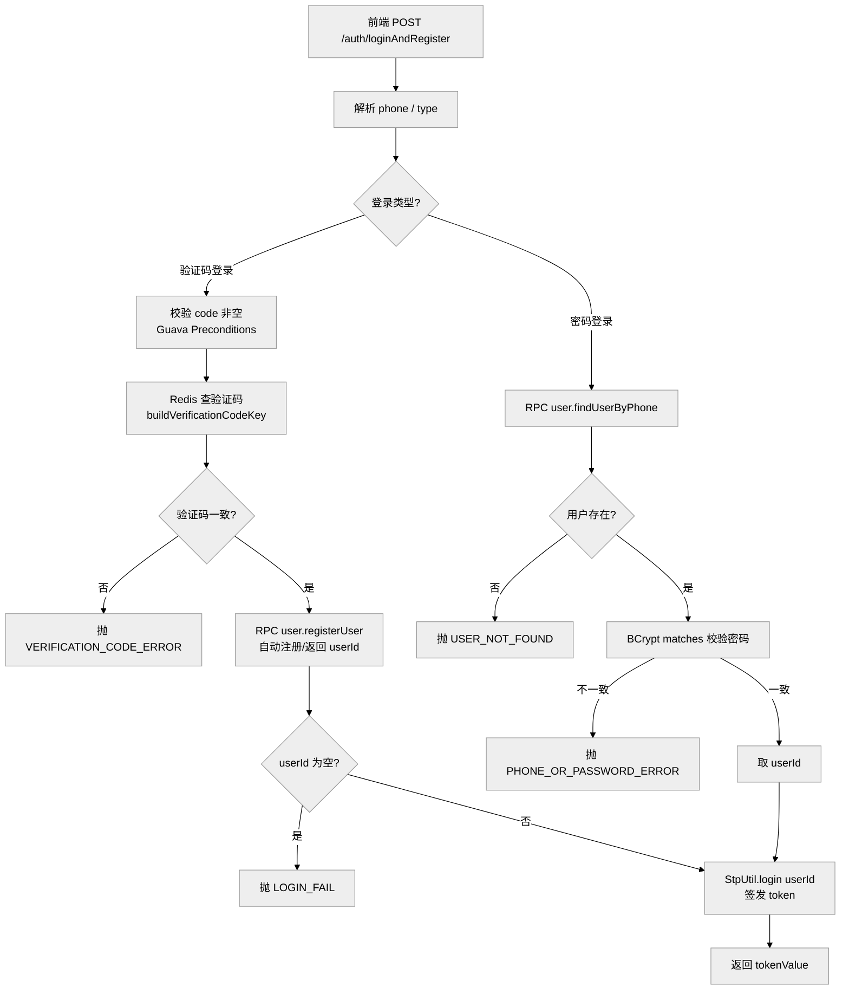

**要点**：验证码登录 = 自动注册（新用户首次验证码登录即注册）；密码登录 = 老用户校验密码。

---

## 2. 退出登录（auth）

**代码**：[AuthServiceImpl.logout](file:///d:/java/xiaohashu/xiaohashu/xiaohashu-auth/src/main/java/com/quanxiaoha/xiaohashu/auth/service/impl/AuthServiceImpl.java#L138-L152)

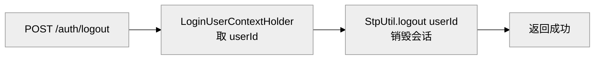

---

## 3. 修改密码（auth）

**代码**：[AuthServiceImpl.updatePassword](file:///d:/java/xiaohashu/xiaohashu/xiaohashu-auth/src/main/java/com/quanxiaoha/xiaohashu/auth/service/impl/AuthServiceImpl.java#L162-L172)

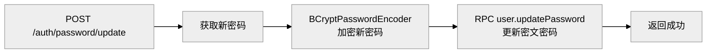

---

## 4. 用户信息查询（user）

**代码**：[UserServiceImpl.findById](file:///d:/java/xiaohashu/xiaohashu/xiaohashu-user/xiaohashu-user-biz/src/main/java/com/quanxiaoha/xiaohashu/user/biz/service/impl/UserServiceImpl.java#L293-L348)

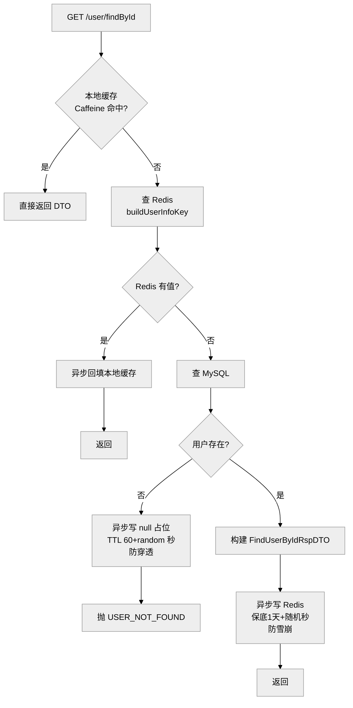

**要点**：三级缓存（Caffeine → Redis → MySQL），写缓存全部放异步线程不阻塞主线程；空值占位防穿透、TTL 随机打散防雪崩。

---

## 5. 角色权限数据同步（user）

**代码**：[PushRolePermissions2RedisRunner](file:///d:/java/xiaohashu/xiaohashu/xiaohashu-user/xiaohashu-user-biz/src/main/java/com/quanxiaoha/xiaohashu/user/biz/runner/PushRolePermissions2RedisRunner.java#L57-L129)

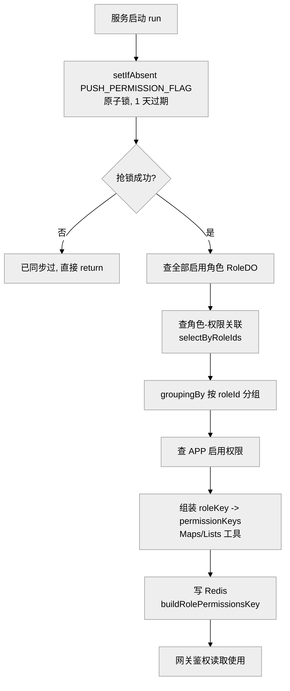

**要点**：启动时一次性把"角色 → 权限集合"预热到 Redis，网关 `StpInterfaceImpl` 查权限时直接读 Redis，不再访问 DB。

---

## 6. 发布笔记（note）

**代码**：[NoteServiceImpl.publishNote](file:///d:/java/xiaohashu/xiaohashu/xiaohashu-note/xiaohashu-note-biz/src/main/java/com/quanxiaoha/xiaohashu/note/biz/service/impl/NoteServiceImpl.java#L103-L203)

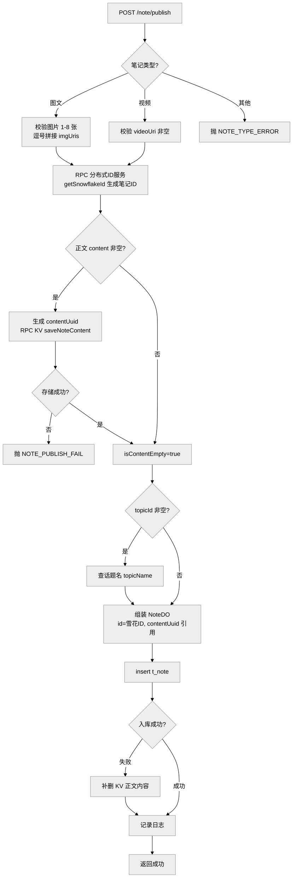

**要点**：正文与元数据分离存储——MySQL 存元数据 + `content_uuid` 引用，Cassandra（KV）存大文本；ID 由分布式 ID 服务生成。

---

## 7. 查询笔记详情（note）

**代码**：[NoteServiceImpl.findNoteDetail](file:///d:/java/xiaohashu/xiaohashu/xiaohashu-note/xiaohashu-note-biz/src/main/java/com/quanxiaoha/xiaohashu/note/biz/service/impl/NoteServiceImpl.java#L212-L325)

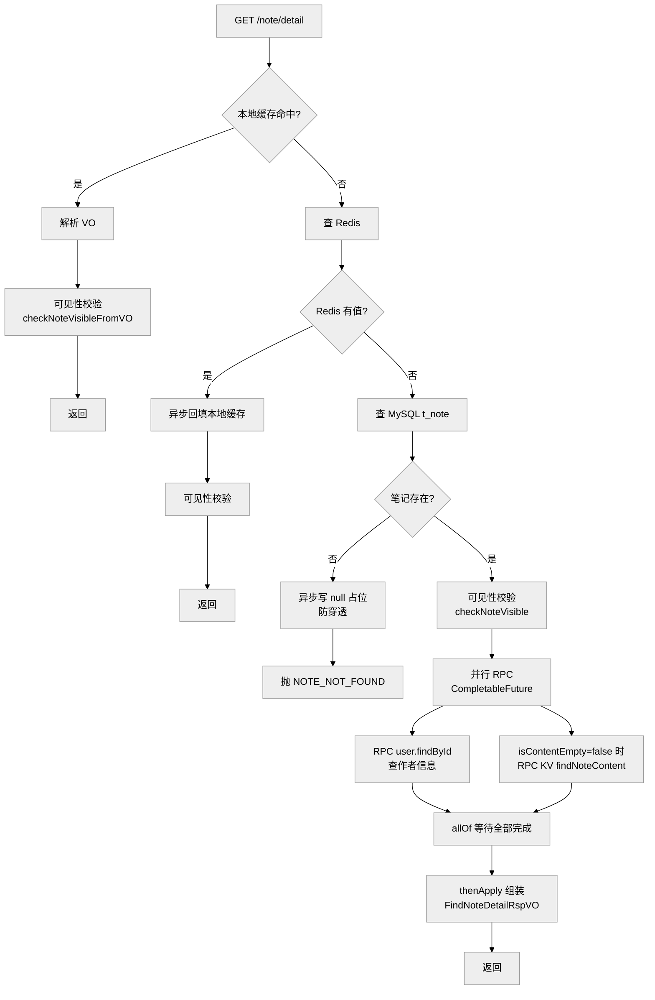

**要点**：两级缓存 + 可见性校验（缓存命中也要校验）；查作者 + 查正文两个 RPC 用 `CompletableFuture` 并行执行，接口耗时取最慢者。

---

## 8. 更新笔记（延迟双删）（note）

**代码**：[NoteServiceImpl.updateNote](file:///d:/java/xiaohashu/xiaohashu/xiaohashu-note/xiaohashu-note-biz/src/main/java/com/quanxiaoha/xiaohashu/note/biz/service/impl/NoteServiceImpl.java#L351-L468)

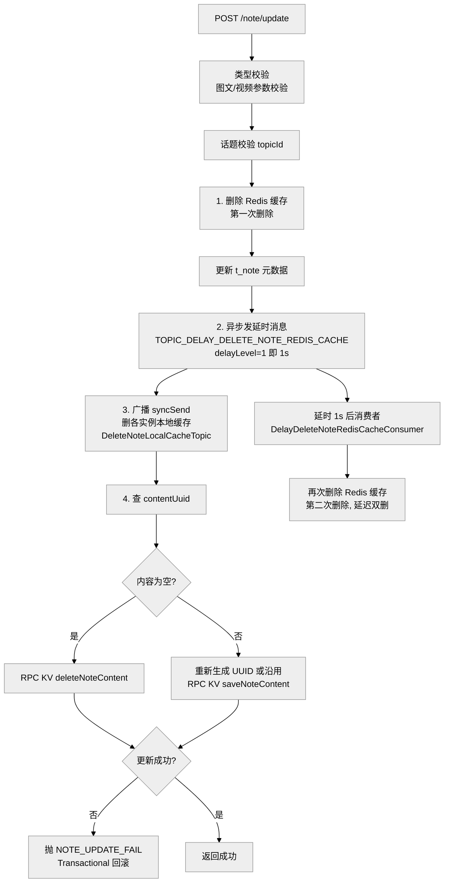

**要点**：**延迟双删**保证缓存一致性——先删一次缓存、更新 DB 后发 1s 延时消息再删一次，清掉并发读回填的脏缓存；本地缓存靠广播 MQ 通知所有实例删除；内容更新走 KV 服务。

---

## 9. 网关统一鉴权（gateway）

**代码**：[SaTokenConfigure](file:///d:/java/xiaohashu/xiaohashu/xiaohashu-gateway/src/main/java/com/quanxiaoha/xiaohashu/gateway/config/SaTokenConfigure.java)、[AddUserId2HeaderFilter](file:///d:/java/xiaohashu/xiaohashu/xiaohashu-gateway/src/main/java/com/quanxiaoha/xiaohashu/gateway/filter/AddUserId2HeaderFilter.java)、[StpInterfaceImpl](file:///d:/java/xiaohashu/xiaohashu/xiaohashu-gateway/src/main/java/com/quanxiaoha/xiaohashu/gateway/auth/StpInterfaceImpl.java)

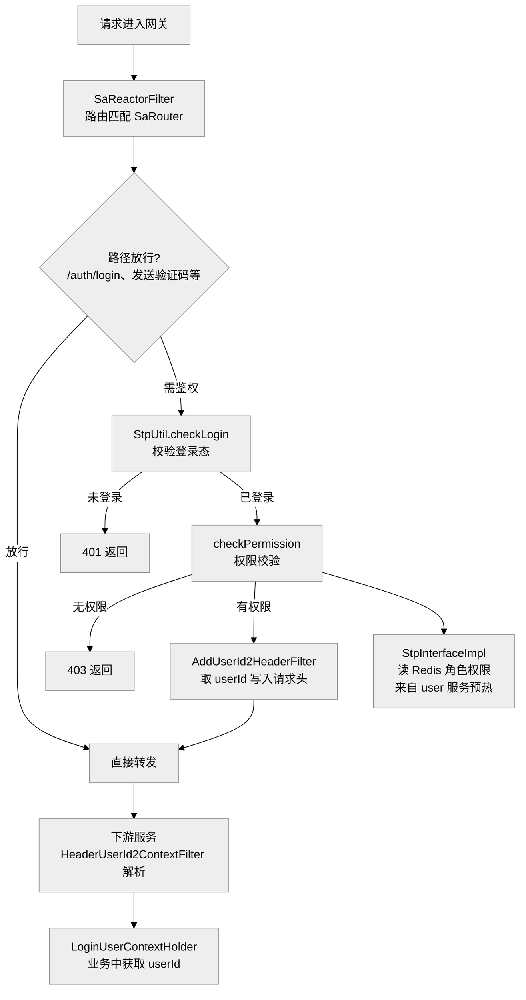

**要点**：网关无状态鉴权——登录态存 Redis（Sa-Token 整合 Redis），权限数据由 user 服务启动时预热，网关按角色/权限校验后把 userId 透传给下游服务。

---

## 10. 更新用户信息（user）

**代码**：[UserServiceImpl.updateUserInfo](file:///d:/java/xiaohashu/xiaohashu/xiaohashu-user/xiaohashu-user-biz/src/main/java/com/quanxiaoha/xiaohashu/user/biz/service/impl/UserServiceImpl.java#L157-L242)

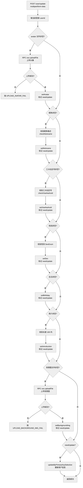

**要点**：头像/背景图走 **oss 服务 RPC 上传**返回 URL；昵称/工大社区号/性别/简介做格式校验；只有任一字段有值时（`needUpdate`）才更新 DB。

---

## 11. 删除笔记（note）

**代码**：[NoteServiceImpl.deleteNote](file:///d:/java/xiaohashu/xiaohashu/xiaohashu-note/xiaohashu-note-biz/src/main/java/com/quanxiaoha/xiaohashu/note/biz/service/impl/NoteServiceImpl.java#L475-L499)

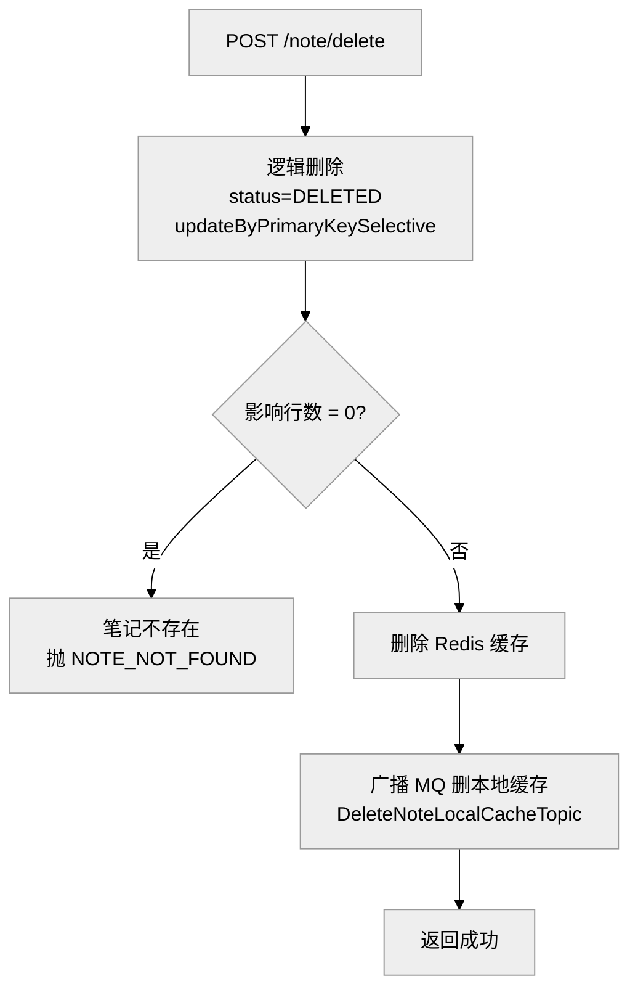

**要点**：**逻辑删除**（只改 `status`，不物理删行）；成功后删 Redis 缓存 + 广播 MQ 删各实例本地缓存。

---

## 12. 仅自己可见（note）

**代码**：[NoteServiceImpl.visibleOnlyMe](file:///d:/java/xiaohashu/xiaohashu/xiaohashu-note/xiaohashu-note-biz/src/main/java/com/quanxiaoha/xiaohashu/note/biz/service/impl/NoteServiceImpl.java#L508-L536)

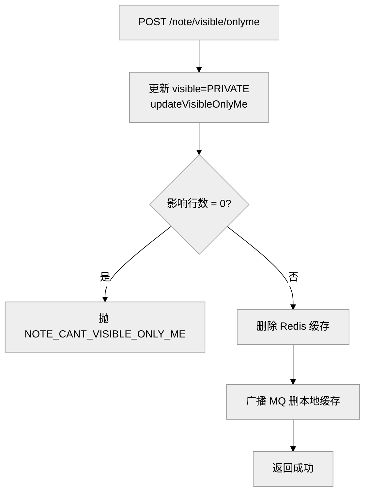

**要点**：可见性改为仅自己可见（`PRIVATE`）；查询详情时 `checkNoteVisible` 会拦截非本人的访问。

---

## 13. 置顶 / 取消置顶（note）

**代码**：[NoteServiceImpl.topNote](file:///d:/java/xiaohashu/xiaohashu/xiaohashu-note/xiaohashu-note-biz/src/main/java/com/quanxiaoha/xiaohashu/note/biz/service/impl/NoteServiceImpl.java#L544-L576)

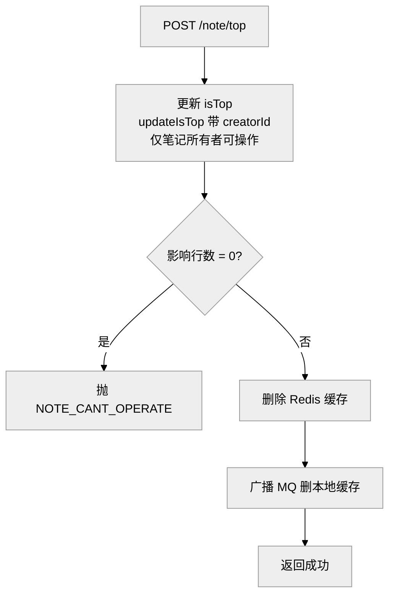

**要点**：置顶/取消置顶共用一个接口（`isTop` 入参）；SQL 里带 `creator_id` 条件保证只有笔记所有者能操作。

---

## 14. 关注用户（user-relation，新模块）

**代码**：[RelationServiceImpl.follow](file:///d:/java/xiaohashu/xiaohashu/xiaohashu-user-relation/xiaohashu-user-relation-biz/src/main/java/com/quanxiaoha/xiaohashu/user/relation/biz/service/impl/RelationServiceImpl.java#L55-L163)、[FollowUnfollowConsumer](file:///d:/java/xiaohashu/xiaohashu/xiaohashu-user-relation/xiaohashu-user-relation-biz/src/main/java/com/quanxiaoha/xiaohashu/user/relation/biz/consumer/FollowUnfollowConsumer.java#L55-L72)、[RelationController](file:///d:/java/xiaohashu/xiaohashu/xiaohashu-user-relation/xiaohashu-user-relation-biz/src/main/java/com/quanxiaoha/xiaohashu/user/relation/biz/controller/RelationController.java#L30-L34)

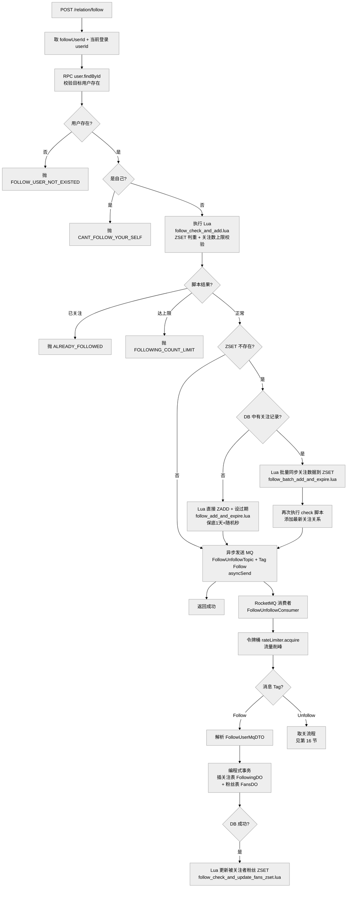

**要点**：关注关系以 **Redis ZSET** 存储（score=关注时间，member=被关注用户 ID），用 **Lua 脚本保证"判重 + 上限校验 + 添加"原子性**；ZSET 不存在时从 DB 全量同步（TTL 随机打散，防穿透）。写 Redis 后**异步发送 MQ**（`FollowUnfollowTopic` + Tag `Follow`），由 `FollowUnfollowConsumer` **令牌桶 `acquire()` 削峰**，再编程式事务写入关注表 + 粉丝表，成功后用 Lua 更新被关注者的粉丝 ZSET，最后发 MQ 通知计数服务（见第 18 节）——Redis 管"热点读 + 原子判断"，MQ 管"异步解耦 + 削峰"，MySQL 管"持久化兜底"。

---

## 15. 查询关注列表（user-relation）

**代码**：[RelationServiceImpl.findFollowingList](file:///d:/java/xiaohashu/xiaohashu/xiaohashu-user-relation/xiaohashu-user-relation-biz/src/main/java/com/quanxiaoha/xiaohashu/user/relation/biz/service/impl/RelationServiceImpl.java#L291-L367)、[RelationController.findFollowingList](file:///d:/java/xiaohashu/xiaohashu/xiaohashu-user-relation/xiaohashu-user-relation-biz/src/main/java/com/quanxiaoha/xiaohashu/user/relation/biz/controller/RelationController.java#L43-L47)

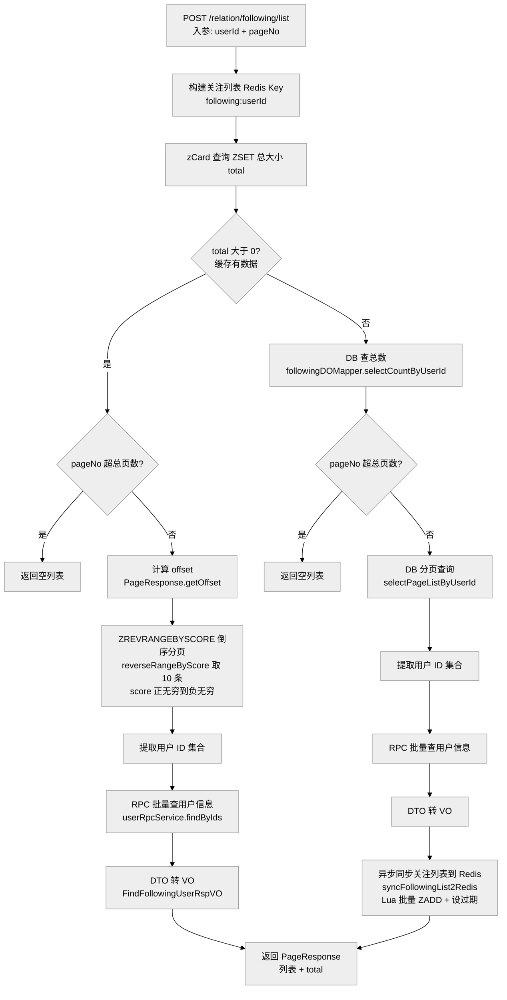

**要点**：**缓存优先**——Redis ZSET 用 `zCard` 拿总数、`reverseRangeByScore` 按关注时间倒序分页（每页 10 条，关注时间戳作为 score）；**缓存未命中**（ZSET 不存在）才查 DB，查完**异步全量同步回 Redis**（最多 1000 个关注对象），下次请求走缓存。查到的只是"用户 ID 集合"，真实头像昵称靠 **RPC 批量调 user 服务** `findByIds` 补全（DTO 转 VO）。

---

## 16. 取关用户（user-relation）

**代码**：[RelationServiceImpl.unfollow](file:///d:/java/xiaohashu/xiaohashu/xiaohashu-user-relation/xiaohashu-user-relation-biz/src/main/java/com/quanxiaoha/xiaohashu/user/relation/biz/service/impl/RelationServiceImpl.java#L183-L283)、[FollowUnfollowConsumer.handleUnfollowTagMessage](file:///d:/java/xiaohashu/xiaohashu/xiaohashu-user-relation/xiaohashu-user-relation-biz/src/main/java/com/quanxiaoha/xiaohashu/user/relation/biz/consumer/FollowUnfollowConsumer.java#L163-L211)

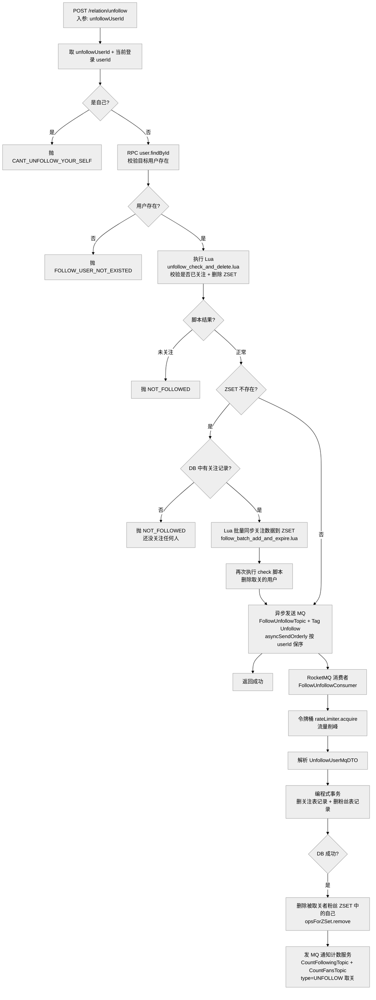

**要点**：取关与关注**对称但相反**：Lua 脚本 `unfollow_check_and_delete.lua` 校验"是否已关注"并删除 ZSET（未关注直接抛错）；**ZSET 不存在时同样从 DB 全量同步兜底再删**。关键差异：发送 MQ 用 **`asyncSendOrderly(destination, message, hashKey, callback)`**，hashKey 取 `userId`（操作方），保证"同一用户的关注/取关消息按顺序被顺序消费"，避免落库乱序（比如先取关后关注被颠倒）。消费者侧 `FollowUnfollowConsumer` 同样用**顺序消费**（`ConsumeMode.ORDERLY`）+ 令牌桶削峰，成功后**删除被取关者的粉丝 ZSET** 并**发 MQ 通知计数服务**。

---

## 17. 查询粉丝列表（user-relation）

**代码**：[RelationServiceImpl.findFansList](file:///d:/java/xiaohashu/xiaohashu/xiaohashu-user-relation/xiaohashu-user-relation-biz/src/main/java/com/quanxiaoha/xiaohashu/user/relation/biz/service/impl/RelationServiceImpl.java#L424-L494)

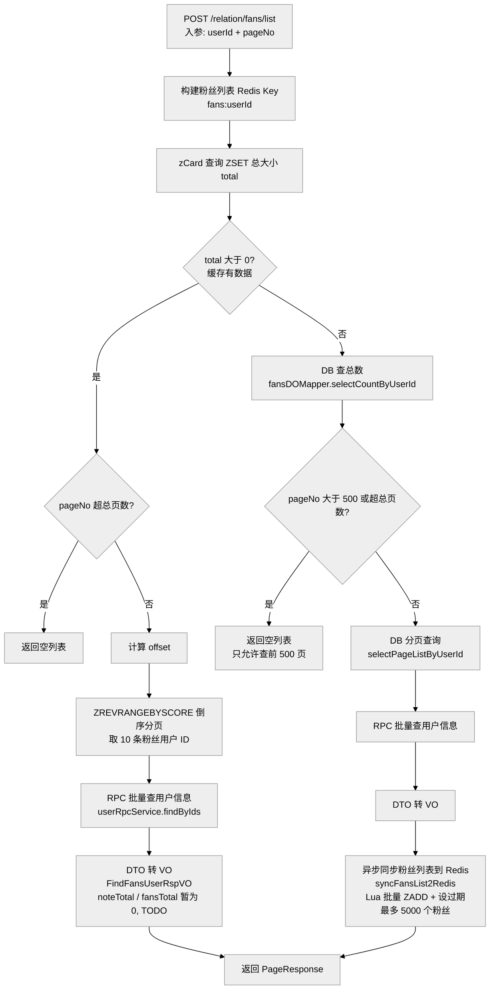

**要点**：粉丝列表与关注列表**结构完全对称**（同是 ZSET 分页 + DB 兜底 + 异步回填），差异点：① 粉丝上限同步 **5000 条**（大 V 粉丝多）；② 分页限制**最多 500 页**；③ VO 预留了 `noteTotal`（笔记总数）、`fansTotal`（粉丝总数）字段，**待接入计数服务**（TODO，见第 18 节）。

---

## 18. 粉丝数 / 关注数计数（count）

**代码**：[FollowUnfollowConsumer.sendMQ](file:///d:/java/xiaohashu/xiaohashu/xiaohashu-user-relation/xiaohashu-user-relation-biz/src/main/java/com/quanxiaoha/xiaohashu/user/relation/biz/consumer/FollowUnfollowConsumer.java#L216-L246)（生产端）、[CountFansConsumer](file:///d:/java/xiaohashu/xiaohashu/xiaohashu-count/xiaohashu-count-biz/src/main/java/com/quanxiaoha/xiaohashu/count/biz/consumer/CountFansConsumer.java#L54-L133)（粉丝数消费）、[CountFollowingConsumer](file:///d:/java/xiaohashu/xiaohashu/xiaohashu-count/xiaohashu-count-biz/src/main/java/com/quanxiaoha/xiaohashu/count/biz/consumer/CountFollowingConsumer.java#L41-L88)（关注数消费）、[CountFans2DBConsumer](file:///d:/java/xiaohashu/xiaohashu/xiaohashu-count/xiaohashu-count-biz/src/main/java/com/quanxiaoha/xiaohashu/count/biz/consumer/CountFans2DBConsumer.java#L35-L53)（落库）

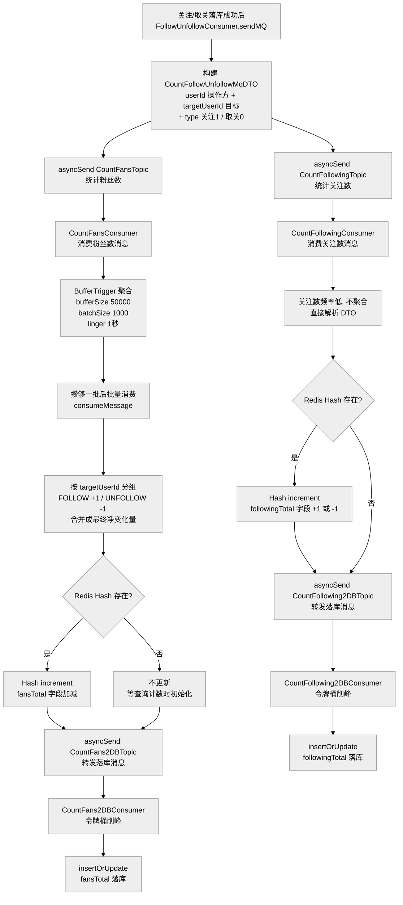

**要点**：计数服务（`xiaohashu-count`）从"关注/取关消费者"接手计数：**关注数**（我关注别人）频率低，单条直接处理；**粉丝数**（别人关注我）可能瞬间暴涨，用 **BufferTrigger 聚合**（1 秒或 1000 条触发一次），按 `targetUserId` 分组把多次 `+1/-1` 合并成**净变化量**，一次 `Hash increment` 更新 Redis（`count:user:{id}` 的 `fansTotal` / `followingTotal` 字段，**只有 Hash 存在才更新**，初始化由查询计数时完成）。计数先写 Redis，再**转发二级 MQ** 落库（`CountXxx2DBTopic`），落库消费者用**令牌桶削峰** + `insertOrUpdate`（存在则更新、不存在则插入）。

---

## 19. 数据对齐（日增量落库 + XXL-JOB 分片对齐，data-align）

### 19.1 为什么有了 count 服务还要 data-align？（定位）

**count 服务是"实时近似计数"，data-align 是"次日精确对账"，两者是两层设计，不重复：**

| | count 服务（实时） | data-align（次日对齐） |
|--|-------------------|----------------------|
| 时机 | 事件发生**当下** | 事件发生**次日**（XXL-JOB 定时） |
| 方式 | 事件来一条处理一条（BufferTrigger 聚合）→ Redis Hash **±1 累加** → 异步落库 | 从**源表**（`t_note_like`/`t_fans` 等真实关系数据）`count(*)` **重算当前准确值** → **覆盖**回写 |
| 特点 | **快**（秒级）、可能**不准**（MQ 重复、聚合窗口、Redis Hash 不存在时不更新等） | **准**（以源表为准）、慢（次日） |
| 关系 | 先给用户看近似值 | 第二天用真实数据**校准修正** → **最终一致** |

> 一句话：**count 负责"当时大概多少"，data-align 负责"第二天精确多少"。** 这也是为什么 count 落库用"累加"（`+1/-1`）也不用担心——错了明天对齐会纠正。

### 19.2 总体流程（文字版）

**写侧：当天实时，4 个消费者把"谁变了"记进临时表**

```
业务服务发 MQ（点赞 / 收藏 / 关注 / 发布变更消息）
  → TodayXxxIncrementData2DBConsumer 解析 DTO（取业务 ID + 发布者 ID）
  → 双 Bloom 判重（BF.EXISTS）
      ├─ 已登记  → 跳过（当天同一对象只记一次）
      └─ 未登记  → id % tableShards 算分片
                    → insert 分片临时表 t_data_align_xxx_temp_日期_分片
                    → 落库成功 → BF.ADD 登记（先落库后登记，防漏）
                    → 落库失败 → 记日志不登记（后续消息可重试）
```

**读侧：次日 XXL-JOB，9 个 Job 从源表重算回写**

```
CreateTableXxlJob 每日预建次日 7 类 × 分片临时表
  → 7 个分片广播对齐任务（getShardIndex / getShardTotal，各实例处理自己的分片）
      → 处理昨日分片表（先兜底 CREATE TABLE IF NOT EXISTS，防建表任务漏跑）
      → 批量查 1000 条变更 ID（order by id limit）
      → 循环直到查空：
          ├─ 逐个 ID 从源表 count（t_note_like / t_fans / t_following …）
          ├─ 覆盖回写 t_user_count / t_note_count
          ├─ Redis Hash 存在才同步（count:user:id / count:note:id）
          └─ 批量删除已处理记录（保证幂等）
  → DeleteTableXxlJob 清理一个月前的临时表
```

---

### 19.3 写侧：当天实时把"谁变了"落临时表（4 消费者 → 7 类）

**触发源**：业务服务发 MQ，count 与 data-align 各订各的 topic：

| 消费者（data-align） | 订阅 Topic | 变更来源 |
|---------------------|-----------|---------|
| `TodayUserFollowIncrementData2DBConsumer` | `TOPIC_COUNT_FOLLOWING` | 关注/取关（user-relation） |
| `TodayNoteLikeIncrementData2DBConsumer` | `TOPIC_COUNT_NOTE_LIKE` | 点赞/取消（note） |
| `TodayNoteCollectIncrementData2DBConsumer` | `TOPIC_COUNT_NOTE_COLLECT` | 收藏/取消（note） |
| `TodayNotePublishIncrementData2DBConsumer` | `TOPIC_NOTE_OPERATE` | 发布/删除笔记（note） |

**消费者处理流程**（以 [TodayNoteLikeIncrementData2DBConsumer](file:///d:/java/xiaohashu/xiaohashu/xiaohashu-data-align/src/main/java/com/quanxiaoha/xiaohashu/data/align/consumer/TodayNoteLikeIncrementData2DBConsumer.java#L46-L126) 为例，其余三个结构相同）：

1. **解析消息**：`JsonUtils.parseObject(body, LikeUnlikeNoteMqDTO.class)`，取出 `noteId`（被点赞笔记）+ `noteCreatorId`（发布者）；
2. **笔记维度判重**：Lua 脚本 `bloom_today_note_like_check.lua` 对 Bloom key（按日期）执行 `BF.EXISTS noteId`：
   - 已登记 → 跳过（当天这篇笔记已记过）；
   - 未登记 → 继续；
3. **落分片临时表**：`noteId % tableShards` 算分片 → `insertMapper.insert2DataAlignNoteLikeCountTempTable(表后缀, noteId)`，表名 `t_data_align_note_like_count_temp_日期_分片`；
4. **落库成功后才登记**：`BF.ADD` 把 noteId 加进 Bloom（先落库后登记，保证幂等不丢）；
5. **发布者维度重复 2-4**：对 `noteCreatorId` 用**另一个独立的 Bloom key**，落 `t_data_align_user_like_count_temp` 表（双 Bloom，见问题十三/追问）。

**4 消费者 → 7 类临时表映射**：

| 消费者 | 维度 | 临时表 | 唯一索引 |
|--------|------|--------|---------|
| 关注/取关 | 源用户 `userId` | `following_count_temp` | `uk_user_id` |
| 关注/取关 | 目标用户 `targetUserId` | `fans_count_temp` | `uk_user_id` |
| 点赞 | 笔记 `noteId` | `note_like_count_temp` | `uk_note_id` |
| 点赞 | 发布者 `creatorId` | `user_like_count_temp` | `uk_user_id` |
| 收藏 | 笔记 `noteId` | `note_collect_count_temp` | `uk_note_id` |
| 收藏 | 发布者 `creatorId` | `user_collect_count_temp` | `uk_user_id` |
| 发布 | 发布者 `creatorId` | `note_publish_count_temp` | `uk_user_id` |

> ⚠️ **关键理解：临时表只记"今天哪些对象发生过变更"的 ID 清单（去重后），不记 `+1/-1` 过程。** 所以"点赞了又取消"不会删除记录，也不会新增——第二次事件来时 Bloom 已登记直接跳过；具体数值第二天从源表重算（见 19.4），根本不需要知道中间加了几次减了几次。

---

### 19.4 读侧：次日 XXL-JOB 分片对齐，从源表重算回写

**① 建表任务**：[CreateTableXxlJob](file:///d:/java/xiaohashu/xiaohashu/xiaohashu-data-align/src/main/java/com/quanxiaoha/xiaohashu/data/align/job/CreateTableXxlJob.java#L36-L64)（每日）——用**明天**的日期，按 `tableShards` 循环建 7 类 × 分片临时表（`CREATE TABLE IF NOT EXISTS`，含 `uk_note_id`/`uk_user_id` 唯一索引）。

**② 7 个分片广播对齐任务**（每日处理**昨天**），统一流程（以 [FollowingCountShardingXxlJob](file:///d:/java/xiaohashu/xiaohashu/xiaohashu-data-align/src/main/java/com/quanxiaoha/xiaohashu/data/align/job/FollowingCountShardingXxlJob.java#L47-L112) 为例）：

1. **取分片参数**：`XxlJobHelper.getShardIndex()/getShardTotal()`，本实例只处理 `shardIndex` 对应的分片表；
2. **兜底建表**：`createTableMapper.createDataAlignXxxCountTempTable(表后缀)`——对齐任务查询前先建表，防止"建表任务漏跑"导致报"表不存在"；
3. **批量查询变更 ID**：`selectBatchFromDataAlignXxxCountTempTable` 一次查 1000 条（`order by id limit 1000`），死循环直到查空；
4. **逐个从源表重算准确值**（对照 [SelectMapper.xml](file:///d:/java/xiaohashu/xiaohashu/xiaohashu-data-align/src/main/resources/mapper/SelectMapper.xml)）：

| 对齐任务 | 源表 SQL（准确值来源） | 回写目标 |
|---------|----------------------|---------|
| `FollowingCountShardingXxlJob` | `select count(*) from t_following where user_id=?` | `t_user_count.following_total` |
| `FansCountShardingXxlJob` | `select count(*) from t_fans where user_id=?` | `t_user_count.fans_total` |
| `NoteLikeCountShardingXxlJob` | `select count(*) from t_note_like where note_id=? and status=1` | `t_note_count.like_total` |
| `NoteCollectCountShardingXxlJob` | `select count(*) from t_note_collection where note_id=? and status=1` | `t_note_count.collect_total` |
| `UserLikeCountShardingXxlJob` | `count from t_note_like where status=1 and note_id in (select note_id from t_note where creator_id=?)` | `t_user_count.like_total` |
| `UserCollectCountShardingXxlJob` | `count from t_note_collection where status=1 and note_id in (select note_id from t_note where creator_id=?)` | `t_user_count.collect_total` |
| `NotePublishCountShardingXxlJob` | `select count(*) from t_note where creator_id=? and status=1` | `t_user_count.note_total` |

5. **回写计数表**：`updateUserXxxTotalByUserId / updateNoteXxxTotalByNoteId` ——**覆盖更新**（把重算值直接 set 进去，不是累加）；
6. **同步 Redis**：`count:user:{id}` / `count:note:{id}` Hash **存在才更新**（`hasKey` 判断），不强制创建——避免把"查询时才初始化"的 Redis 值覆盖成旧值；
7. **批量删除已处理记录**：`batchDeleteDataAlignXxxCountTempTable(表后缀, ids)` ——删掉这批，保证幂等（下次对齐不重复处理）；
8. 回到第 3 步继续下一批，直到查空。

**③ 清理任务**：[DeleteTableXxlJob](file:///d:/java/xiaohashu/xiaohashu/xiaohashu-data-align/src/main/java/com/quanxiaoha/xiaohashu/data/align/job/DeleteTableXxlJob.java#L36-L72)（每日）——从昨天往前推一个月，按日期 × 分片循环 `DROP TABLE IF EXISTS` 清理过期临时表。

---

### 19.5 关键设计点

1. **"变更清单 + 源表重算"而非"累计变更"**：临时表只记"谁变了"，不记变化量——所以点赞又取消、+1-1 反复都无所谓，第二天一律从源表 `count(*)` 拿当前真实值，**天然正确**；
2. **双 Bloom 先落库后登记**：同一对象同一天只落一次库（挡在 DB 前减少写入），且落库成功才登记（幂等防漏）；即使 Bloom 漏判，临时表唯一索引（`uk_note_id`/`uk_user_id`）兜底；
3. **分片存储 + 分片广播并行**：7 类表按 `id % tableShards` 分片，次日 N 台执行器各处理一片，处理能力随实例数扩展；查询前兜底建表防漏跑；
4. **覆盖写 vs count 的累加写**：count 落库用 `insertOrUpdate` 累加（`+1/-1`），data-align 用**覆盖**（重算值直接 set）——后者才是"对齐"的本意；
5. **删已处理记录**：对齐完一批删一批，重复调度不重复处理（幂等）；XxlJobHelper 细节见 [XXL-JOB使用总结.md](file:///d:/java/xiaohashu/xiaohashu/docs/02-开发指南/XXL-JOB使用总结.md)。
